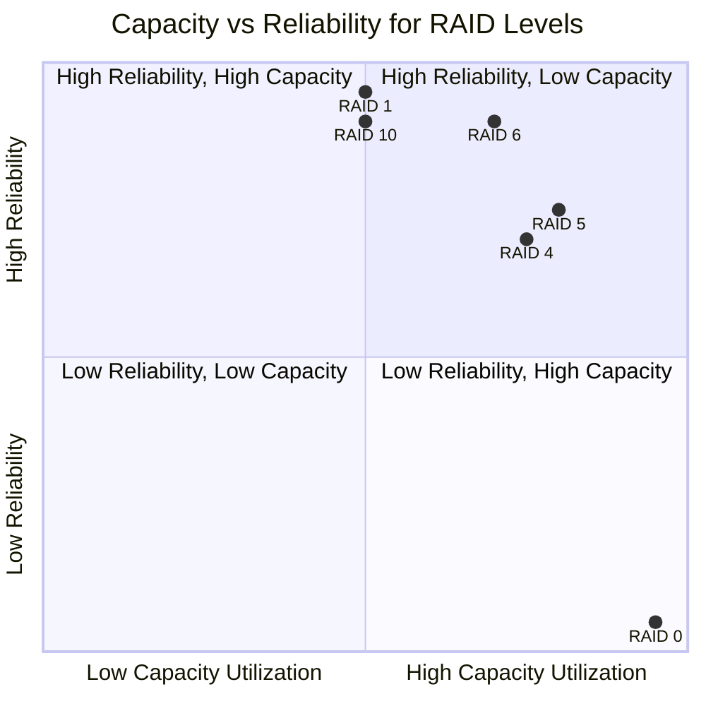

> [!idea] RAID Levels Comparison
> **Performance Metrics Explanation**:
> - $n$ = number of disks
> - $c$ = capacity of one disk
> - $L_{disk}$ = latency of a single disk
> - $t_{disk}$ = throughput of a single disk
> - $p$ = probability of single disk failure
> 
> **Comparison Table**:
> 
> | RAID Level | Capacity | Fault Tolerance | Read Latency | Write Latency | Sequential Read Throughput | Sequential Write Throughput | Random Read Throughput | Random Write Throughput |
> |------------|----------|-----------------|--------------|---------------|---------------------------|----------------------------|------------------------|-------------------------|
> | RAID 0 | $n * c$ | 0 disks | $L_{disk}$ | $L_{disk}$ | $n * t_{disk}$ | $n * t_{disk}$ | $n * t_{disk}$ | $n * t_{disk}$ |
> | RAID 1 | $n/2 * c$ | $n/2$ disks | $L_{disk}$ | $2 * L_{disk}$ | $n/2 * t_{disk}$ | $t_{disk}$ | $n * t_{disk}$ | $t_{disk}$ |
> | RAID 4 | $(n-1) * c$ | 1 disk | $L_{disk}$ | $2 * L_{disk}$ | $(n-1) * t_{disk}$ | $\min(t_{parity}, (n-1) * t_{disk})$ | $(n-1) * t_{disk}$ | $t_{parity}$ |
> | RAID 5 | $(n-1) * c$ | 1 disk | $L_{disk}$ | $2 * L_{disk}$ | $n * t_{disk}$ | $(n-1) * t_{disk} / 4$ | $n * t_{disk}$ | $(n-1) * t_{disk} / 4$ |
> 
> **Probability of Data Loss**:
> - RAID 0: $1 - (1 - p)^n$
> - RAID 1: $p^n$ (for $n$ even)
> - RAID 4 and 5: $1 - (1-p)^n - np(1-p)^{n-1}$
> 
> 
> **Advantages and Disadvantages**:
> 
> RAID 0:
> + Highest performance and full capacity utilization
> - No fault tolerance
> 
> RAID 1:
> + Excellent read performance and high reliability
> - 50% capacity utilization
> 
> RAID 4:
> + Good read performance and fault tolerance
> - Write bottleneck due to dedicated parity disk
> 
> RAID 5:
> + Good balance of performance, capacity, and redundancy
> - Write performance impact due to parity calculations
> 
> RAID 6:
> + High fault tolerance (can lose two disks)
> - More complex parity calculations, slightly lower write performance
> 
> RAID 10:
> + Excellent performance and good fault tolerance
> - 50% capacity utilization

> [!consider] What Happened to RAID 2 and 3?
> RAID 2 and RAID 3 are rarely used in modern systems due to their limitations and the superiority of other RAID levels.
> 
> **RAID 2**:
> - Used bit-level striping with Hamming code for error correction
> - Required a specific number of disks (usually 7 or 15)
> - Became obsolete as disk controllers incorporated error correction
> 
> **RAID 3**:
> - Used byte-level striping with dedicated parity disk
> - Similar to RAID 4 but with finer granularity
> - Limited by single-threaded performance and parity disk bottleneck
> - RAID 4 and 5 proved more versatile and efficient for most use cases
> 
> Both RAID 2 and 3 were theoretically interesting but proved impractical for most real-world applications, leading to their obsolescence in favor of more efficient RAID levels.

Now, let's create a graph showing the relationship between capacity utilization and reliability for different RAID levels.

This graph visually represents the trade-offs between capacity utilization and reliability for different RAID levels. RAID 0 offers the highest capacity but lowest reliability, while RAID 1 and RAID 10 provide high reliability at the cost of capacity. RAID 5 and RAID 6 attempt to balance both factors, with RAID 6 offering higher reliability but slightly lower capacity utilization.