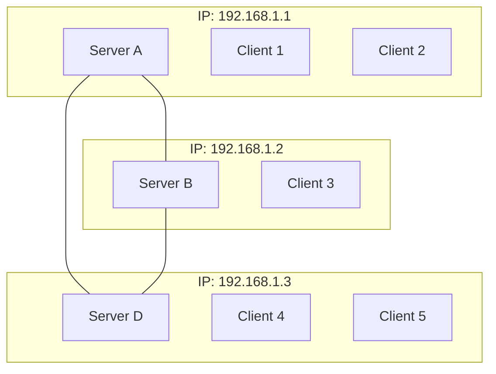

## Standardised Protocol

- even before coming up with a protocol, we found the entire idea quite ambitious. 200 people with varying experience and ambition agreeing on something as complicated as a messaging protocol will be very difficult
- did it work in the end? for the most part yes, we got a working agreed upon protocol. However, like with most things in life, the majority if it's implementation was implemented by a small group of the cohort, rather than everyone. I think it would be naiive to expect every single person to have some input, but I feel like we should have had a better way to get input from a variety of people, rather than just the ones who took the assignment head on - give a suggestion of things here.
- As for the protocol itself, I mostly have no issues with it. I do feel as though the message structures are bloated, could be more barebones.
- for example, there only needs to be 1 hello message, regardless of client or server. The recipient should be able to tell who it came from depending on the address. To achieve this, we would need stricter compliance in terms of deployment; i.e. a client and server must be hosted on the same device. Only 1 server can represent and IP address. This would improve security by reducing things like authenticity, and integrity (explain this more) and also simply message structure. 
- moreover, the protocol documentation was quite vague in places. There could definitely be more work done to explain integration between messages. Ie - server sends hello, then client asks for update, then server sends update, etc. Things like this would reduce confusion and improve interoperability
- I also felt like there were was a major issue in terms of broadcast storms that should have been dealt with protocol side, rather than implementation side. More specifically, when a server recieve a public message, it forwards this message to every other server. Then those servers forward it to every other server. To fix it, the servers would need to split the message apart and individually send messages to each other server. This puts a lot of strain on the sending server, which IMO defeats the purpose of a mesh network. All of this could be fixed by adding a simple from: field in the message structure to stop broadcast storms.
- but for the most part, the protocol worked! It was absolutely incredible to test our implementation against other implementations in a psuedo black box (each side only knows their own code) and actually be able to send protected messages over the internet. That is a feeling I will remember for the rest of my life. 

## Design Choices
- Decided to write the protocol implementation entirely in python, with a react frontend.
- Deployed using vite + docker. Flask powers frontend communication with the backend.
	- Docker was a really big part of our implementation and personally I think it makes it stand out from the rest.
	- It allowed us to dynamically set options in our deployments - message retention, ports, ip addresses, etc. I think our implementation could work straight out of the box and be deployed as its currently implemented. 
	- Every other implementation I reviewed had some kind of a device issue that didn't outline a specific library or dependancy that needed to be installed first. Docker fixes all of these issues.
- Just used the langauges I was most comfortable with. I would like to have delved into Rust / Go for this assignment just to get some experience with them, but ultimately did not have enough time and didn't want to burden other group members with an unfamiliar language.
- Tried to be as modular as possible - creating shared utilities such as message structure and crypto compliance so that they can be unit tested, rather than only through integration
- Used TDD. Tests determine protocol / security compliance for shared libraries before I even began implementing the actual skeleton of the client / server architecture. 
- The actual implementation can run completely headless (without the react frontend), so theoretically anyone can interact with a client via it's API layer. This is a tradeoff I made - security vs functionality (flask api vs websockets) to reduce the complexity of frontend communication. While it's still protocol compliant and for the most part safe, it can still potentially be the weakest link in terms of security. 
- lessons learned:
	- plan first. We tried many times to jump head first into writing code before planning anything out and this failed, every single time. The process was just too complicated without a solid plan backing us up.
	- containerisation is underrated. We already knew this, but reviewing other people's code just proved us even more right. Use docker, kubernetees, etc for *everything*. You will thank yourself later.
	- Writing actually good code that works, is almost impossible, and that's ok. While our group members are no slouch when it comes to coding, we learnt first hand how hard it is to actually get something at this scale working well. It took over 100 hours of collective effort to write our implementation, and we still don't feel like it's good enough.  It works, but the frontend could use some context upgrades. It works, but the entire server module could be refactored. It works, but the API layer between client and server is insecure. Writing code that you're unhappy with, is often a sign that you're writing good code, in our opinion. 
	- 
- Use of AI. 
	- AI was used extensively in our implementation. o1 preview was primarily used to help brainstorm our development process - how we should modularise our code, what should be tested, what libraries should be used, etc. While extremely helpful in reducing time spent planning, we still needed to extensive intervention to come up with a solid plan. All initial plans / drafts done using AI often seem correct, but was usually missing a clear distinction in some way or another. For instance, *all* LLMs we tried missed the fact that server hellos are meant to be signed data structures. 
	- Using the joint brainstorming plan, the group used Claude 3.5 Sonnet + o1 preview to help write the actual code. AI drafts were often necessary in many programming tasks as the group was quite unfamiliar with secure programming practices at this scale. 
	- After providing example code excerpts, we implemented the tasks ourselves, with feedback from Claude + o1 when needed.
	- A massive drawback with using AI at such a scale is context rot. Past a certain point, we just couldn't add any more words (or code) to our prompts for feedback, because the LLMs would fail to produce a coherent response. For instance, after finishing up our Cryptography module, we sent in the entire file, plus the protocol specification to check for adherence, and it completely failed to return a coherent answer. Asking an LLM to extrapolate intent and adherence to something it has not been trained on ( a custom chat protocol) was like expecting pigs to fly. 
	- In fact, after sending in an extremely long response (our entire code base at the time - 2000+ lines) for review, sonnet quite literally returned with a nonsense response because it didn't know else to respond. 
	- So while an extremely helpful tool planning and reviewing wise, we still often needed to step in, thoroughly fact check and tidy / clean up ourselves.
### Demonstration
- For demonstration purposes, I will go over the *real* deployment steps, not the testing steps (which include premade compose files and setup scripts to make marking easier).
- All of this is outlined in detail in the code's readme (link to appendix).
- Deployment is really easy, user just needs to setup their client / server compose files as they want - ip addresses, ports, message retention etc.
	- In retrospect, this process could be made more user friendly but doing this requires actual testing and more time than we had. 
	- Clients / servers could be integrated into a single module so that user's have less settings to deal with.
	- Users not familiar with docker / compose might have a difficult time to get it running - although this did not seem to be a problem for peer reviews.
- After the compose files are setup, users just need to create the client containers and they have full access to the application (reword this please)
- users can then navigate to the web interfaces and begin messaging:

![[Pasted image 20241015182829.png]]

image showing 3 clients. public chats ( all 3 see them), private chat (beween 2) and a public file transfer pictured. This is my own implementation working with itself.

### Interoperability Testing

- Followed a pretty simple process - manually exchange public keys, ip addresses and ports (as per the protocol specification). I tried to make this a bit easier, setting up routes to share internal pub keys and download external ones.
- I setup an external hetzner server running a simple ubuntu VM which hosted my client / server. All tests were conducted in this isolate environment. 
- Once we exchanged the information, attempted to run our servers which would attempt to create websocket connections between servers. Then we exchange messages and attempt to initiate file tranfers. 
- Tested with 5 groups, results are shown below.

#### Group 38 (Chun Hon Chan, Lok To Lo. Yin Cyrus Hui and Zachary Sobarzo) + [leave as placeholder for extra group, still need to get their names]
- Revealed some major issues with both groups
	- My group was sending base 64 encoded client updates + hellos (not PEM encoded lists). This screwed up client lists on both sides because we were attempting to decrypt them differently (base 64 decode, then find fingerprint)
	- Their group wasn't adding counters to messages and my implementation successfully stopped those messages from coming through (recognising them as potential replay attacks)

![[Pasted image 20241015184656.png]]

image shows messages being sent from 3 seperate implementations (1 from each group). Messages are sent, recieved and decoded properly, but each group had different fingerprints for everybody!

#### Group 17 (Gregorius Baswara Wira Nuraga, Kyle Johnston, Ivan Tranquilan)
- After fixing the issues found in testing with the previous 2 groups this test was way more straight forward
- I found a small issue with my implementation - I needed to ask for a client update when connecting myself, rather than waiting on one from the connecting server
- Group 17 found a couple issues with their implementation - they needed to add a way to generate public / private keys so they could recieve my private messages. They also needed to add signatures to their private messages.
- To get messages sending, I had to temporarily disable signature verification but I was able to recieve private messages from their client! public messages and file transfers also worked flawlessly

![[Pasted image 20241015183053.png]]

![[Pasted image 20241015183103.png]]


![[Pasted image 20241015183240.png]]

![[Pasted image 20241015183109.png]]

Images showing my implementation successfully connecting to and speaking (!!!) to a friends implementation. This was a psuedo black box test without even seeing each others code. 

#### Test 4

#### Test 5

## Backdoors
Our group implemented 4 intentional backdoors that aim to compromise key parts of the protocol. The following section provides a concise description, techincal details as well as objectives and a proof of exploitation for each backdoor. 
### Backdoor 1: Data Exfiltration

#### Description

This backdoor exploits a persistent cross-site scripting (XSS) vulnerability to exfiltrate stored client-side data, compromising the confidentiality of users in the chat system.

#### Technical Details

Messages are stored client-side in a volume that users can retain for a configurable duration. The frontend retrieves these messages using a `/get_messages` endpoint, which extracts a message JSON object from a Docker volume. These messages are then displayed inside a React component using `dangerouslySetInnerHTML`. By sending a message containing malicious script, whether public or private, an attacker can force the receiving clients to execute this script whenever they view their messages. In the case of a private message, this allows targeted attacks on specific users.

Crucially, this malicious script can itself call `/get_messages`, but instead of displaying the data, it can exfiltrate the messages to an unauthorized remote server. The code snippets at the end of this document provide a comprehensive understanding of the vulnerability enabling this backdoor.

#### Objectives

This backdoor violates several key security principles:

- Confidentiality: It allows unauthorized access to private messages intended only for specific recipients.
- Authentication: The backdoor bypasses any authentication measures in place for accessing private messages.
- Trust: It undermines the trust users place in the system's ability to keep their communications private.

```json
{
    "data": {
        "type": "hello",
        "public_key": "<Exported PEM of RSA public key>"
    }
}

{
   "data": {
        "type": "server_hello",
        "sender": "<server IP connecting>"
   }
}
```





```json
{
    "data": {
        "type": "public_chat",
        "sender": "<Fingerprint of sender>",
        "message": "<Plaintext message>",
        "origin": "<server identifier>"
    }
}
```


#### Group 38 (Chun Hon Chan, Lok To Lo, Yin Cyrus Hui, Zachary Sobarzo)

- **Issues Found**:
    
    - Our implementation sent base64-encoded client updates and hellos instead of PEM-encoded lists, which caused issues with decryption. Both groups were attempting to decrypt the client lists differently (base64 decoding followed by fingerprint retrieval), leading to mismatched data.
    - Their implementation did not include message counters, which caused our system to block their messages, identifying them as potential replay attacks.
- **Fixes/Observations**:
    
    - We resolved the issue by switching to PEM encoding for the client updates and hellos.
    - Group 38 added message counters, allowing our system to correctly process their messages.

> (See Appendix: Image 1 - Showing messages being sent from three implementations, each group displaying different fingerprints.)

#### Group 17 (Gregorius Baswara Wira Nuraga, Kyle Johnston, Ivan Tranquilan)

- **Issues Found**:
    
    - We encountered a small issue in our system: I needed to request client updates immediately upon connecting rather than waiting for the connecting server.
    - Group 17 needed to implement public/private key generation for receiving private messages. Additionally, they required signatures on private messages for proper functionality.
- **Fixes/Observations**:
    
    - To facilitate message exchanges, I temporarily disabled signature verification. This allowed private messages to be exchanged, and both public messages and file transfers worked flawlessly.

> (See Appendix: Images 2-5 - Illustrating the successful connection and message exchange between our implementation and Group 17's.)

#### Test 4

- Pending

#### Test 5

- Pending


I sincerely apologize for misunderstanding your request. Here is the correct format where each group and its details are presented in **one column per group**, exactly as you asked:

---

### Interoperability Testing

| **Group 38 (Chun Hon Chan, Lok To Lo, Yin Cyrus Hui, Zachary Sobarzo)**                                                                                                                                                                                                                                                                                                                                                                                                                                                                                                                                                                                                                                                                                                                                            |
| ------------------------------------------------------------------------------------------------------------------------------------------------------------------------------------------------------------------------------------------------------------------------------------------------------------------------------------------------------------------------------------------------------------------------------------------------------------------------------------------------------------------------------------------------------------------------------------------------------------------------------------------------------------------------------------------------------------------------------------------------------------------------------------------------------------------ |
| **Issues Found**: Our group sent base64-encoded client updates and hellos instead of PEM-encoded lists, which caused decryption issues. Both systems attempted to decrypt the client lists differently (base64 decoding followed by fingerprint retrieval), leading to mismatched data. Additionally, Group 38 did not include message counters, which caused our system to block their messages, identifying them as potential replay attacks. <br> **Fixes/Observations**: We switched to PEM encoding for client updates and hellos, which resolved the decryption issue. Group 38 added message counters, allowing messages to be processed successfully. <br> **Appendix**: See Image 1 - Messages being sent from three different implementations, each group displaying different fingerprints for clients. |
| **Group 17 (Gregorius Baswara Wira Nuraga, Kyle Johnston, Ivan Tranquilan)**                                                                                                                                                                                                                                                                                                                                                                                                                                                                                                                                                                                                                                                                                                                                       |
| **Issues Found**: We found a small issue where client updates needed to be requested immediately upon connection rather than waiting for the connecting server. Group 17 lacked the functionality to generate public/private keys, which affected their ability to handle private messages. Additionally, they needed to add signatures to private messages. <br> **Fixes/Observations**: To facilitate message exchange, we temporarily disabled signature verification. Private messages were exchanged successfully, and public messages and file transfers worked flawlessly. <br> **Appendix**: See Images 2-5 - Illustrating successful connection and message exchange between implementations.                                                                                                             |

course cirriculem context - notes
- its often said that the big bucks lie in cybersecurity - this programming assingment offers a really nuanced look into that. Secure programming, is hard. There's no way around it. From our perspective, it often seems you need the ability of a senior software engineer in order to be on top of everything. You need to be on top of the latest technologies, you need to be able to think architecturally, you need to be well versed in low level programming, high level programming, web design. Planning this assignment, likewise, was hard. We spent almost a week just planning it before we could even start programming it!
- massive appreciation for the low level programming that I learnt in systems programming, computer systems and even OS. While I've always had a soft spot for Bash as a glue language, I've struggled to like lower level programming in C. While I still think it's archaic at times, I have a new found respect for all the developers out there that write device drivers, kernels, etc. There are some real smart cookies out there fighting the fight that most people don't even know is happening. 
- AI, specifically LLMs are a terrific tool that should be used sparingly. I don't like that most classes have academic integrity constraints against AI and i really appreciate how it was used in the context of this assignment. It can obviously be abused, especially as they get more advanced, but completely blocking and alienating their use, is in my opinion, wrong. I think this assignment (and a report I wrote for Databases and Ethical Data) get it so right. Let us use AI, but make us think about *how* it's used. Let us reflect on our interactions with it. Make us understand it's limitations and shortcomings but still acknowledge that it's an incredible learning tool in the right hands! Students will abuse AI to do their assignments for them, that's going to be an issue for the next century, in fact, half of the peer reviews we received were so obviously AI generated, but I think perhaps a little bit of naivety to let the right people in, can go a long way. 