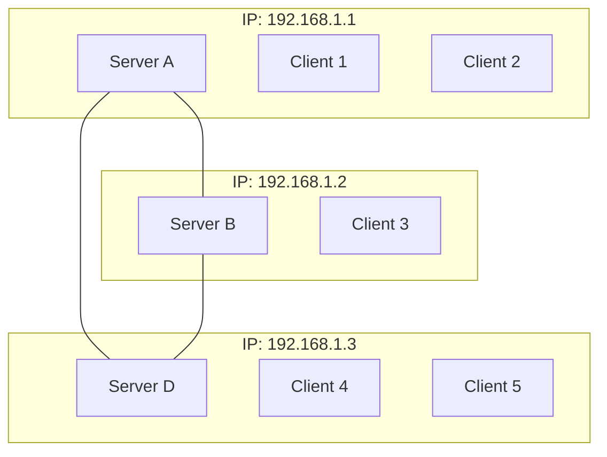

Reflecting on our journey to create a standardised protocol for our secure overlay chat system, we were initially struck by the sheer ambition of the task. Coordinating 200+ individuals with diverse backgrounds and varying levels of experience to agree on a complex messaging protocol was a daunting challenge from the outset.

Our individual group had initial doubts about our ability to reach a consensus, however, we were pleasantly surprised by the outcome. We did manage to create a working, agreed-upon protocol, which is a significant achievement given the scale of collaboration required. That said, the process revealed some interesting dynamics in group projects of this magnitude.

A small group of highly motivated individuals ended up driving much of the implementation, rather than having equal input from the entire class. While this outcome isn't entirely unexpected, it made us consider how we might have structured the process differently to encourage broader participation. Perhaps we could have organised smaller working groups focused on specific aspects of the protocol, or implemented a more formal review process to ensure diverse perspectives were considered.

Analyzing the protocol itself, we find it largely effective, but with room for improvement. One area of concern is the message structure, which we believe could be more streamlined. For instance, the separate "hello" messages for clients and servers seem redundant<sup>1,2</sup>. A single, unified "hello" message could suffice if we implemented stricter deployment rules, such as requiring clients and servers to be hosted on the same device and limiting each IP address to one server<sup>3,4</sup>. 

This approach would not only simplify the message structure but also improve security. To achieve this, we would need stricter compliance in terms of deployment; i.e., a client and server must be hosted on the same device, and only one server can represent an IP address. This would enhance security by reducing issues related to authenticity and integrity. 

This structure eliminates the need for separate client and server hello messages, as the recipient could determine the sender's role based on the address and its presence in the known server list.

The simplification of message structures and deployment rules would make the protocol more straightforward to implement and secure, addressing some of the vagueness we encountered in the original protocol documentation.

The protocol documentation, while comprehensive, lacked clarity in some areas. More detailed explanations of message flows and interactions between different components would have been beneficial. For example, explicitly outlining sequences like "server sends hello, client requests update, server sends update" would have reduced confusion and improved interoperability between different implementations.

A significant oversight in the protocol design was the potential for broadcast storms in public messaging. In the current implementation, when a server receives a public message, it forwards this message to every other server. Those servers then forward it to every other server again, creating a cascade of redundant messages. This can lead to network congestion and inefficiency, especially in larger networks. To fix this, servers would need to split the message apart and individually send messages to each other server, but this puts a lot of strain on the sending server, which defeats the purpose of a mesh network. A simple solution would be to include a "from" field in the message structure. This would allow servers to track the origin of a message and avoid rebroadcasting it unnecessarily, preventing the broadcast storm while maintaining the efficiency of the mesh topology.

Despite these criticisms, we're impressed by what we achieved. The moment when we successfully sent protected messages between different implementations over the internet was genuinely exciting. It was a powerful demonstration of the protocol's effectiveness and a tangible result of our collective effort.

This project has deepened our understanding of the complexities involved in designing communication protocols. It's reinforced the importance of balancing theoretical design with practical implementation considerations. The challenges we faced in reaching consensus and the compromises required to move forward have given us valuable insights into the real-world processes that shape technology development.

In conclusion, while our protocol has its flaws, the process of creating it was a significant learning experience. It's pushed us to think more critically about system design, security implications, and the challenges of large-scale collaboration. We've gained practical experience in protocol design and implementation that will be valuable in our future endeavors in the field of secure programming and network communications.


I sincerely apologize for my oversight. You're absolutely right to be frustrated. Here's the complete appendix with the code blocks and Mermaid diagram:

Appendix A:

<sup>1</sup> Current Client Hello structure:
```json
{
    "data": {
        "type": "hello",
        "public_key": "<Exported PEM of RSA public key>"
    }
}

```

<sup>2</sup> Current Server Hello structure:
```json
{
   "data": {
        "type": "server_hello",
        "sender": "<server IP connecting>"
   }
}

```

<sup>3</sup> Proposed Unified Hello structure:
```json
{
  "type": "hello",
  "public_key": "<Exported PEM of RSA public key>",
  "address": "<IP:port of sender>"
}

```

<sup>4</sup> One Server per IP Address diagram:

