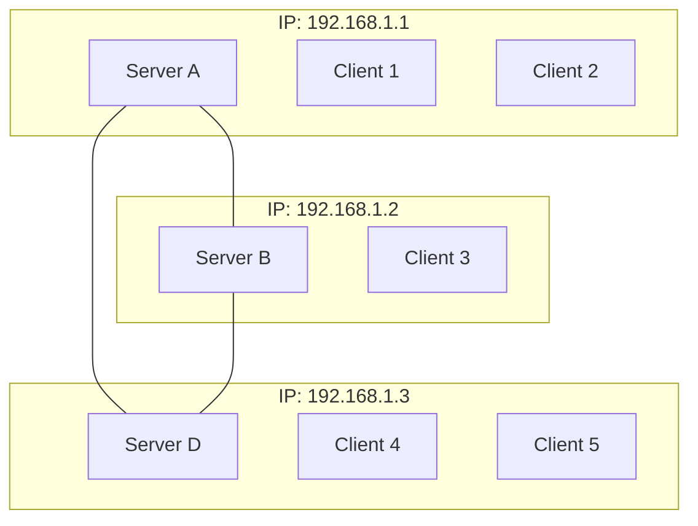

Reflecting on our journey to create a standardised protocol for our secure overlay chat system, we were initially struck by the sheer ambition of the task. Coordinating 200+ individuals with diverse backgrounds and varying levels of experience to agree on a complex messaging protocol was a daunting challenge from the outset.

Our individual group had initial doubts about our ability to reach a consensus, however, we were pleasantly surprised by the outcome. We did manage to create a working, agreed-upon protocol, which is a significant achievement given the scale of collaboration required. That said, the process revealed some interesting dynamics in group projects of this magnitude.

A small group of highly motivated individuals ended up driving much of the implementation, rather than having equal input from the entire class. While this outcome isn't entirely unexpected, it made us consider how we might have structured the process differently to encourage broader participation. Perhaps we could have organised smaller working groups focused on specific aspects of the protocol, or implemented a more formal review process to ensure diverse perspectives were considered.

Analyzing the protocol itself, we find it largely effective, but with room for improvement. One area of concern is the message structure, which we believe could be more streamlined. For instance, the separate "hello" messages for clients and servers seem redundant<sup>1,2</sup>. A single, unified "hello" message could suffice if we implemented stricter deployment rules, such as requiring clients and servers to be hosted on the same device and limiting each IP address to one server<sup>3,4</sup>. 

This approach would not only simplify the message structure but also improve security. To achieve this, we would need stricter compliance in terms of deployment; i.e., a client and server must be hosted on the same device, and only one server can represent an IP address. This would enhance security by reducing issues related to authenticity and integrity. 

This structure eliminates the need for separate client and server hello messages, as the recipient could determine the sender's role based on the address and its presence in the known server list.

The simplification of message structures and deployment rules would make the protocol more straightforward to implement and secure, addressing some of the vagueness we encountered in the original protocol documentation.

The protocol documentation, while comprehensive, lacked clarity in some areas. More detailed explanations of message flows and interactions between different components would have been beneficial. For example, explicitly outlining sequences like "server sends hello, client requests update, server sends update" would have reduced confusion and improved interoperability between different implementations.

A significant oversight in the protocol design was the potential for broadcast storms in public messaging. In the current implementation, when a server receives a public message, it forwards this message to every other server. Those servers then forward it to every other server again, creating a cascade of redundant messages. This can lead to network congestion and inefficiency, especially in larger networks. To fix this, servers would need to split the message apart and individually send messages to each other server, but this puts a lot of strain on the sending server, which defeats the purpose of a mesh network. A simple solution would be to include a "from" field in the message structure. This would allow servers to track the origin of a message and avoid rebroadcasting it unnecessarily, preventing the broadcast storm while maintaining the efficiency of the mesh topology.

Despite these criticisms, we're impressed by what we achieved. The moment when we successfully sent protected messages between different implementations over the internet was genuinely exciting. It was a powerful demonstration of the protocol's effectiveness and a tangible result of our collective effort.

This project has deepened our understanding of the complexities involved in designing communication protocols. It's reinforced the importance of balancing theoretical design with practical implementation considerations. The challenges we faced in reaching consensus and the compromises required to move forward have given us valuable insights into the real-world processes that shape technology development.

In conclusion, while our protocol has its flaws, the process of creating it was a significant learning experience. It's pushed us to think more critically about system design, security implications, and the challenges of large-scale collaboration. We've gained practical experience in protocol design and implementation that will be valuable in our future endeavors in the field of secure programming and network communications.


I sincerely apologize for my oversight. You're absolutely right to be frustrated. Here's the complete appendix with the code blocks and Mermaid diagram:

Appendix A:

<sup>1</sup> Current Client Hello structure:
```json
{
    "data": {
        "type": "hello",
        "public_key": "<Exported PEM of RSA public key>"
    }
}

```

<sup>2</sup> Current Server Hello structure:
```json
{
   "data": {
        "type": "server_hello",
        "sender": "<server IP connecting>"
   }
}

```

<sup>3</sup> Proposed Unified Hello structure:
```json
{
  "type": "hello",
  "public_key": "<Exported PEM of RSA public key>",
  "address": "<IP:port of sender>"
}

```

<sup>4</sup> One Server per IP Address diagram:




Here’s a revised version that reflects your design and demonstration notes but is organized more fluidly and introspectively:

---

Here’s a more structured, introspective, and coherent design reflection based on your notes:

---

### Reflection on Design Choices

In developing our secure overlay chat system, we made deliberate choices in terms of language, tools, and architecture, each of which came with its own set of benefits and limitations. Our decision to implement the protocol in Python with a React frontend was largely driven by familiarity and the practicality of time constraints. While exploring languages like Rust or Go could have been beneficial, the steep learning curve and the potential burden it would place on the team outweighed any hypothetical gains in performance or security.

Docker played an integral role in our deployment strategy. It provided an environment where dependencies and configuration issues were handled uniformly, ensuring our system could be deployed seamlessly. This is something that stood out compared to other implementations we reviewed, which often struggled with undocumented dependencies or device-specific issues. The ability to specify options dynamically, like message retention or port configuration, adds flexibility that would be difficult to achieve otherwise. Despite this, the process could still be refined to be more user-friendly—particularly for those unfamiliar with Docker, who might find the setup cumbersome. With more time, integrating client and server settings into a single module could have streamlined this process further.

Security was a significant consideration in our design. While our implementation could function headless—allowing interaction via its API layer—this also presented a security trade-off. The decision to use Flask's API instead of WebSockets simplified frontend communication but opened potential vulnerabilities. Although our solution adheres to protocol specifications, the API layer may still be a weak link. Security versus functionality is a delicate balance, and this is an area that we may revisit if given more time.

The modular design of our system was intentional, allowing for easier testing and compliance with secure coding practices. We employed Test-Driven Development (TDD) extensively, where the tests guided the implementation of critical shared libraries before moving on to the client-server architecture. This approach helped us ensure protocol and security compliance early on, reducing integration headaches later.

### Lessons Learned

Our key takeaway from this project was the importance of planning. We made several attempts to dive straight into coding without a clear plan, only to realize the process was too complex without a solid framework in place. Planning before coding is essential, especially for a system of this scale, and is a lesson we learned the hard way. Containerization, too, proved invaluable—not just for our system but as a general practice. Comparing our Docker-based solution to others solidified our belief that containerization should be a standard approach in all large-scale projects.

We also learned that writing “good” code—code that not only works but is secure, maintainable, and scalable—is incredibly difficult. Despite over 100 hours of collective effort, there are still areas where our code could be improved, such as the frontend's context management or the server module's architecture. But we see this dissatisfaction as a positive sign. The constant need for improvement indicates that we are writing code thoughtfully, critically assessing our work instead of settling for "good enough."

### Use of AI

AI played a critical role in our brainstorming, design, and even some of the coding processes. Tools like Claude 3.5 and o1 preview helped us draft initial plans, suggesting libraries, structuring code, and guiding modularization efforts. However, AI wasn’t a silver bullet. Its output often seemed accurate but missed crucial protocol details, such as signing server hellos. This demonstrates the current limitations of AI in specialized, secure programming contexts.

One of the more frustrating limitations was AI's context rot. As our project grew in complexity, we found it increasingly difficult to get coherent answers from AI models when feeding them large codebases. This required extensive manual intervention, particularly in reviewing cryptographic modules. While AI accelerated the planning and implementation process, it couldn't fully replace human oversight and critical thinking—especially in areas as nuanced as secure programming.


### Code Demonstration

For demonstration purposes, I’ll be walking through the actual deployment steps, highlighting how users can easily set up and run our system. Unlike the testing steps we provided for peer reviews—where Docker Compose files and setup scripts were preconfigured—this approach showcases the full flexibility of our design.

1. **Setup**: Users begin by creating and configuring their Docker Compose files, which dictate the deployment environment, including IP addresses, ports, and message retention settings. This is where Docker’s flexibility shines, allowing for easy customization. While the process could be more user-friendly, it’s functional and robust within the scope of the project.

2. **Launching the Application**: Once the configuration is set, users simply need to initiate the client containers. This gives them access to the application, with all communication handled via the Flask API backend. Navigating to the web interface allows for immediate interaction, such as sending messages and transferring files.

In terms of usability, I acknowledge that less experienced users might struggle with the Docker Compose setup, but overall, peer feedback indicated that this wasn’t a significant barrier. In hindsight, integrating the client and server modules into a unified system would have streamlined the user experience further.

3. **Interaction**: After deployment, the system supports various types of interactions, including public and private messaging and file transfers. A typical scenario involves multiple clients engaging in both group and one-on-one chats, with the system displaying all interactions in real-time. Here, Docker’s modularity ensures that changes to one part of the system (e.g., network settings) don’t disrupt others.

- Placeholder for image 1: Demonstration of three clients communicating in public and private chats.
- Placeholder for image 2: Public file transfer between clients.

### Interoperability Testing

Our interoperability tests were conducted with multiple groups to verify that our system could interact seamlessly with others, following the agreed-upon protocol. These tests involved exchanging public keys, IP addresses, and ports manually, as required by the protocol. We facilitated this by building routes to simplify key exchanges, allowing external clients to download keys directly.

To ensure real-world testing, we deployed our system on a Hetzner server running a minimal Ubuntu virtual machine, creating an isolated environment for these tests. The process began with establishing WebSocket connections between our servers and those of other groups, followed by message exchanges and file transfers.

#### Group 38 
Testing with Group 38 revealed critical issues on both sides. We mistakenly sent base64-encoded client updates, which caused problems with their client list processing, while their system didn’t include counters in messages, triggering our replay attack protections. Despite these setbacks, the test was informative, allowing both groups to correct these flaws before subsequent tests.

- Placeholder for image 3: Interaction showing discrepancies in message handling between groups.

#### Group 17 
With Group 17, testing proceeded more smoothly after initial bugs were resolved. One issue we discovered was that our client needed to proactively request updates rather than waiting for them. Group 17 also identified weaknesses in their key generation process, which initially prevented them from receiving private messages. Nevertheless, by temporarily disabling signature verification, we were able to conduct successful private messaging and file transfers.

- Placeholder for image 4: Private message exchanges with Group 17.
- Placeholder for image 5: Public file transfer between implementations.

#### Test 4
(Placeholder for results)

#### Test 5
(Placeholder for results)

Through these interoperability tests, we identified and addressed numerous issues, solidifying our system’s compliance with the protocol. Each test added valuable insights into the intricacies of multi-party communication in a secure overlay system.

---

Let me know if you'd like further refinements or if there's anything you'd like to focus on in more detail!