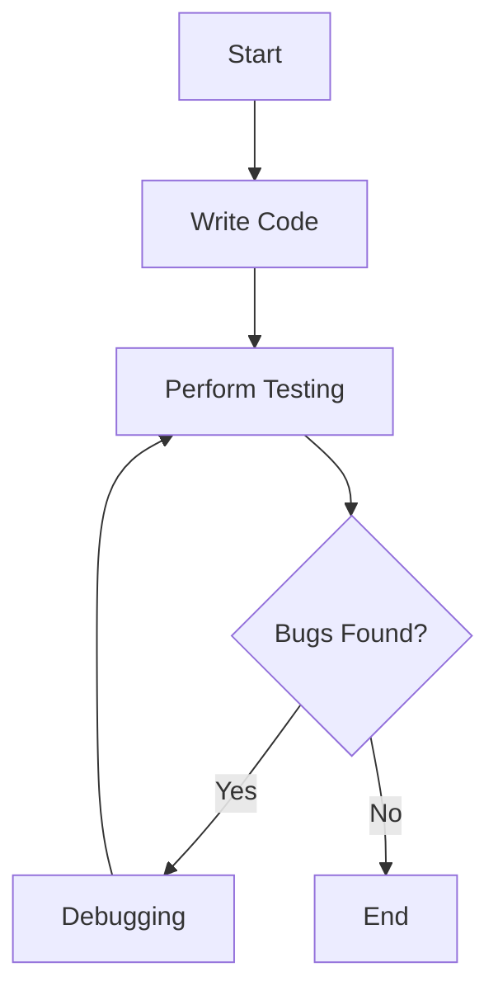
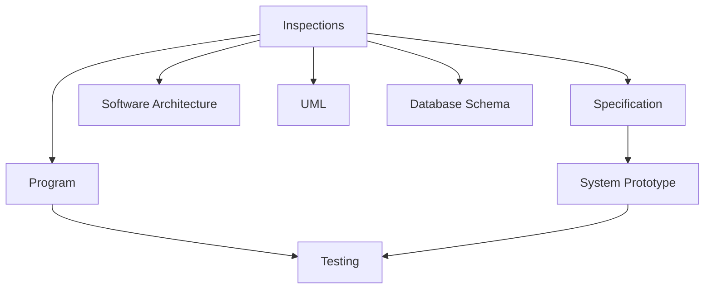
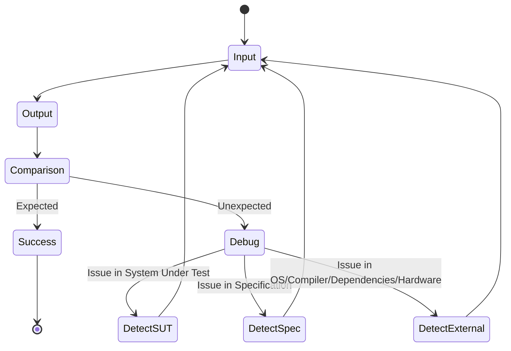
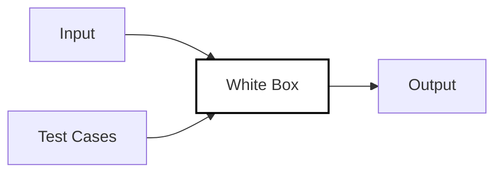

> [!motivation] Consequences of Untested Code
> Software errors can have severe consequences if left undetected:
> - Medical equipment malfunctions leading to patient harm
> - Financial losses for businesses
> - Damaged reputation and loss of future opportunities
> - Legal liabilities and potential lawsuits from stakeholders

> [!idea] Software Testing
> Testing involves verifying that code functions as intended:
> - Define expected output for given inputs
> - Run the program to obtain actual output
> - Compare expected and actual results
>
> **Importance of testing:**
> - Ensures software reliability and functionality
> - Provides confidence in code performance
> - Mitigates risks associated with software failures

> [!consider] Software Bugs
> Bugs are defects in source code that cause program faults:
> - **Origins:**
>   - Human errors (e.g., syntax mistakes)
>   - Misjudgments in function behavior
>   - Miscalculations in algorithms or logic
> - Can lead to unexpected program behavior or crashes

> [!idea] Testing vs. Debugging
> | Aspect | Testing | Debugging |
> |--------|---------|-----------|
> | Purpose | Intentional examination to find bugs | Process of fixing identified bugs |
> | Outcome | Verifies software requirements | Resolves issues in the code |
> | Success means | System operates as intended or bugs are exposed | Bugs are fixed and system functions correctly |
>
> **Testing objectives:**
> - Verify: Ensure the product is built correctly
> - Validate: Confirm the right product is being built

> [!idea] Static vs. Dynamic Testing
> **Static Testing (Inspections):**
> - Involves examining code to identify issues
> - Supplemented by tool-based document and code analysis (e.g., IntelliSense)
> - **Can check:** Code quality, modularity, maintainability, flexibility
> - **Cannot check:** Real requirements, non-functional requirements
>
> **Dynamic Testing:**
> - Involves executing code and observing its behavior
> - Uses test data to verify against expected results
>
> Static and dynamic testing are complementary, not opposing approaches.

This diagram illustrates how inspections (static testing) relate to various software artifacts, and how testing (dynamic testing) connects to the program and system prototype.

> [!example] Testing a Temperature Gauge Component

> [!idea] Testing Process
> 1. Gather requirements
> 2. Design test cases
> 3. Prepare test data
> 4. Run program with test data
> 5. Analyze and compare test results
> 6. Iterate from step 2 if necessary
> 7. Create test reports

> [!consider] Test Case Design
> **Goal:** Create a set of tests that effectively validate requirements and detect defects.
>
> **Challenges:** Exhaustive testing is important but resource-intensive.
>
> **Testing Levels:**
> - **Unit Testing:** Testing individual components in isolation
>   - Derived from programmer experience
> - **Integration Testing:** Testing modules together
> - **System Testing:** Testing the entire system
>   - Determines if major requirements are met
>   - Tester may not know system details
>
> Effective test case design balances thoroughness with resource constraints.

> [!idea] Black Box Testing
> - Based on specified behavior
> - Implementation knowledge not required for test case design
> - Effective for identifying missing logic defects

```mermaid
graph LR
    A[Input] --> B[Black Box]
    B --> C[Output]
    style B fill:#000,stroke:#fff,stroke-width:2px

```

This diagram illustrates the concept of black box testing, where only inputs and outputs are known, and the internal workings are not visible.

> [!idea] White Box Testing
> - Tests designed based on implemented behavior
> - Can be automated
> - More rigorous but requires more expertise
> - Potential for bias as test maker is often a code developer

This diagram shows white box testing, where the internal structure is visible and test cases are designed based on this knowledge.

> [!idea] Path Testing
> Path testing involves designing test cases to cover different execution paths through the code. It aims to ensure that all possible routes through a program are tested.

> [!consider] Code Coverage
> Measures the degree to which source code is executed when test cases are run.
> - Higher coverage generally indicates fewer bugs
> - **Coverage types:**
>   - Statement coverage
>   - Branch coverage
>   - Condition coverage

> [!idea] Partition Testing
> Partition testing involves dividing the input domain into equivalence classes and testing representatives from each class. This approach reduces the number of test cases while maintaining effectiveness.

> [!example] Equivalence Partitions
> For a program accepting 4 to 10 inputs of 5-digit integers greater than 10,000:
> - Test values:
>   - Less than 10,000
>   - Between 10,000 and 99,999
>   - Greater than 99,999
> - Create test cases at and around these boundaries

> [!idea] Integration Testing
> Tests the collection of modules and their interfaces.
> 
> **Approaches:**
> - Top-down: Start with the skeleton and build outwards
> - Bottom-up: Integrate bottom components and work upwards
> - Sandwich: Combination of top-down and bottom-up
> 
> **Key points:**
> - Performed incrementally (e.g., test component 1, then 1 and 2, then 1, 2, and 3)
> - Helps localize errors to single components
> - Can integrate external systems (databases, networks, file systems)

> [!idea] System Testing
> - Integrates components to create subsystems
> - Integrates subsystems to create entire systems
> - Typically uses black box testing
> - Often performed by dedicated Quality Assurance teams
> - Verifies that the entire system meets specified requirements