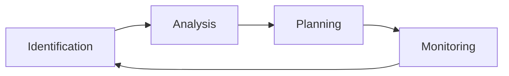

> [!motivation] The Importance of Managing Risks
> - **Unchecked risks can derail projects**, affecting timelines, deliverables, and product quality.
> - Proactively identifying and addressing risks is crucial for successful project completion.

> [!idea] Risk Management: A Systematic Approach
> Risk management is a proactive process that:
> - **Identifies potential risks** that could impact a project
> - **Defines strategies** for preventing, controlling, or mitigating identified risks
> 
> Key aspects of effective risk management:
> - **Start early**: Initiate risk management at the beginning of the project
>   - Improves the likelihood of creating a realistic project plan
>   - Increases the chance of completing the project on time and within budget
> - **Continuous process**: Risk management should be ongoing throughout the project lifecycle

idea - risk identification
1. work backwards from the worst outcomes
	- 