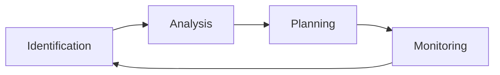

> [!motivation] The Importance of Managing Risks
> - **Unchecked risks can derail projects**, affecting timelines, deliverables, and product quality.
> - Proactively identifying and addressing risks is crucial for successful project completion.

> [!idea] Risk Management: A Systematic Approach
> Risk management is a proactive process that:
> - **Identifies potential risks** that could impact a project
> - **Defines strategies** for preventing, controlling, or mitigating identified risks
> 
> Key aspects of effective risk management:
> - **Start early**: Initiate risk management at the beginning of the project
>   - Improves the likelihood of creating a realistic project plan
>   - Increases the chance of completing the project on time and within budget
> - **Continuous process**: Risk management should be ongoing throughout the project lifecycle

> [!idea] Techniques for Identifying Risks
> 1. **Work backwards from worst-case scenarios**:
>    - Frame questions in terms of nightmares or disasters
>    - Switch perspectives to consider risks from different stakeholders' viewpoints
>    - Ask about disaster scenarios specific to each stakeholder
>    - Imagine partial failure scenarios
> 2. **Consider situations that could lead to these outcomes**:
>    - Brainstorm potential causes and contributing factors
>    - Analyze the chain of events that could result in the identified worst-case scenarios
> 3. **Determine the root causes for each scenario**:
>    - Investigate the underlying reasons behind potential risk events
>    - Use techniques like the 5 Whys or Fishbone Diagrams to identify root causes

> [!example] Risk Identification in Action
> Scenario: A software development project for a new mobile application
>
> Step 1: Identify worst-case scenarios
> - The app fails to launch on time, missing a crucial market window
> - The app is released with critical bugs, resulting in negative user reviews and reputation damage
> - The app's backend infrastructure cannot handle the user load, leading to frequent crashes and downtime
>
> Step 2: Consider situations leading to these outcomes
> - Delays in development due to unclear requirements or scope creep
> - Insufficient testing and quality assurance processes
> - Inadequate scalability testing and infrastructure planning
>
> Step 3: Determine root causes
> - Poor communication between stakeholders and development team
> - Lack of a clear project plan and milestones
> - Insufficient resources allocated to testing and quality assurance
> - Overemphasis on features over performance and reliability
>
> By identifying these risks early in the project, the team can develop targeted strategies to mitigate or prevent them, such as:
> - Establishing clear communication channels and regularly reviewing requirements
> - Defining a comprehensive project plan with realistic timelines and milestones
> - Allocating adequate resources to testing and quality assurance
> - Prioritizing performance, scalability, and reliability throughout the development process

> [!idea] Risk Analysis
> Once risks have been identified, the next step is to analyze them to determine their potential impact and likelihood of occurrence.
> 
> Risk analysis involves:
> 1. **Assessing impact**: Determine the potential consequences of each risk on project objectives, such as schedule, cost, and quality.
> 2. **Evaluating likelihood**: Estimate the probability of each risk occurring based on historical data, expert judgment, or other relevant factors.
> 3. **Prioritizing risks**: Rank risks based on their impact and likelihood to prioritize risk response efforts.
>
> Common tools for risk analysis include:
> - Probability-Impact Matrix
> - Decision Tree Analysis
> - Monte Carlo Simulation

> [!example] Risk Analysis Example
> Scenario: A construction project to build a new office complex
>
> Identified Risk: Delays in obtaining necessary permits and approvals
>
> Risk Analysis:
> - Impact: High - Delays could result in significant schedule overruns and increased costs
> - Likelihood: Moderate - The project is located in an area known for complex permitting processes
> - Priority: High - Based on the combination of high impact and moderate likelihood
>
> The risk is analyzed using a Probability-Impact Matrix, which helps the project team prioritize this risk and allocate appropriate resources to address it.

> [!example] Risk Planning Example
> Scenario: An IT project to implement a new customer relationship management (CRM) system
>
> Identified Risk: Resistance to change among sales team members
>
> Risk Response Planning:
> - Strategy: Mitigate - Develop a comprehensive change management plan to address resistance
> - Actions:
>   1. Engage sales team members early in the project to gather their input and concerns
>   2. Provide training and support to help sales team members understand and adopt the new CRM system
>   3. Identify and empower change champions within the sales team to help drive adoption
>   4. Establish clear communication channels to address concerns and share success stories
> - Contingency Plan: If resistance remains high, consider phasing the rollout or providing additional incentives for adoption
>
> The risk management plan documents this risk, its priority, the chosen mitigation strategy, and specific actions to be taken, ensuring the project team is prepared to address this risk.

> [!example] Risk Monitoring Example
> Scenario: A software development project for a new e-commerce platform
>
> Identified Risk: Unforeseen technical complexities that could delay the project
>
> Risk Monitoring:
> - Regular Review: The project manager assesses the status of this risk during weekly team meetings and tracks progress on any related action items.
> - New Risk Identification: During development, the team discovers a compatibility issue with a third-party payment gateway, which is added to the risk register.
> - Response Effectiveness: The team evaluates the effectiveness of their mitigation strategies, such as proactive communication with the payment gateway provider and allocating additional development resources.
> - Plan Updates: Based on the newly identified risk and the evaluation of response effectiveness, the risk management plan is updated to reflect the current risk landscape and any changes in priorities or strategies.
>
> By continuously monitoring risks, the project team is able to proactively address issues, adapt to new risks, and keep the project on track for successful completion.

> [!idea] Risk Planning
> Risk planning involves developing strategies to address identified risks and minimize their potential impact on the project.
>
> Key steps in risk planning:
> 1. **Develop risk response strategies**: For each identified risk, choose an appropriate response strategy:
>    - Avoid: Change project plans to eliminate the risk
>    - Mitigate: Take actions to reduce the likelihood or impact of the risk
>    - Transfer: Shift the risk's impact to a third party, such as through insurance or contracts
>    - Accept: Acknowledge the risk and plan for its potential impact
> 2. **Create a risk management plan**: Document the identified risks, their priorities, chosen response strategies, and contingency plans.
> 3. **Allocate resources**: Assign resources (time, budget, personnel) to implement risk response strategies and monitor risks throughout the project.
>
> Effective risk planning ensures that project teams are prepared to handle potential issues and minimize their impact on project success.

> [!idea] Risk Monitoring
> Risk monitoring is the ongoing process of tracking identified risks, identifying new risks, and evaluating the effectiveness of risk response strategies throughout the project lifecycle.
>
> Risk monitoring activities include:
> 1. **Regularly reviewing risks**: Assess the status of identified risks and the progress of risk response actions.
> 2. **Identifying new risks**: Continuously monitor the project environment for new or emerging risks.
> 3. **Evaluating risk response effectiveness**: Determine whether chosen risk response strategies are effective in mitigating or preventing risks.
> 4. **Updating the risk management plan**: Revise the risk management plan as needed based on changes in identified risks, new risks, or the effectiveness of risk response strategies.
>
> Tools for risk monitoring include:
> - Risk Register
> - Risk Audits
> - Variance and Trend Analysis
>
> By continuously monitoring risks, project teams can proactively address issues and adjust their risk management strategies to ensure project success.

