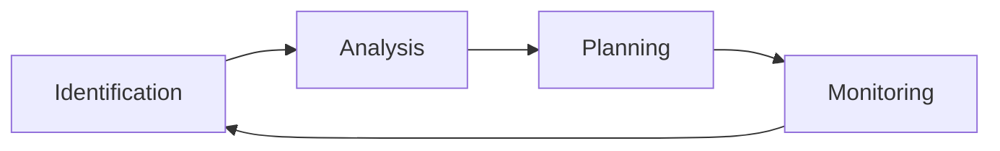

> [!motivation] The Importance of Managing Risks
> - **Unchecked risks can derail projects**, affecting timelines, deliverables, and product quality.
> - Proactively identifying and addressing risks is crucial for successful project completion.

> [!idea] Risk Management: A Systematic Approach
> Risk management is a proactive process that:
> - **Identifies potential risks** that could impact a project
> - **Defines strategies** for preventing, controlling, or mitigating identified risks
> 
> Key aspects of effective risk management:
> - **Start early**: Initiate risk management at the beginning of the project
>   - Improves the likelihood of creating a realistic project plan
>   - Increases the chance of completing the project on time and within budget
> - **Continuous process**: Risk management should be ongoing throughout the project lifecycle

> [!idea] Techniques for Identifying Risks
> 1. **Work backwards from worst-case scenarios**:
>    - Frame questions in terms of nightmares or disasters
>    - Switch perspectives to consider risks from different stakeholders' viewpoints
>    - Ask about disaster scenarios specific to each stakeholder
>    - Imagine partial failure scenarios
> 2. **Consider situations that could lead to these outcomes**:
>    - Brainstorm potential causes and contributing factors
>    - Analyze the chain of events that could result in the identified worst-case scenarios
> 3. **Determine the root causes for each scenario**:
>    - Investigate the underlying reasons behind potential risk events
>    - Use techniques like the 5 Whys or Fishbone Diagrams to identify root causes

> [!example] Risk Identification in Action
> Scenario: A software development project for a new mobile application
>
> Step 1: Identify worst-case scenarios
> - The app fails to launch on time, missing a crucial market window
> - The app is released with critical bugs, resulting in negative user reviews and reputation damage
> - The app's backend infrastructure cannot handle the user load, leading to frequent crashes and downtime
>
> Step 2: Consider situations leading to these outcomes
> - Delays in development due to unclear requirements or scope creep
> - Insufficient testing and quality assurance processes
> - Inadequate scalability testing and infrastructure planning
>
> Step 3: Determine root causes
> - Poor communication between stakeholders and development team
> - Lack of a clear project plan and milestones
> - Insufficient resources allocated to testing and quality assurance
> - Overemphasis on features over performance and reliability
>
> By identifying these risks early in the project, the team can develop targeted strategies to mitigate or prevent them, such as:
> - Establishing clear communication channels and regularly reviewing requirements
> - Defining a comprehensive project plan with realistic timelines and milestones
> - Allocating adequate resources to testing and quality assurance
> - Prioritizing performance, scalability, and reliability throughout the development process