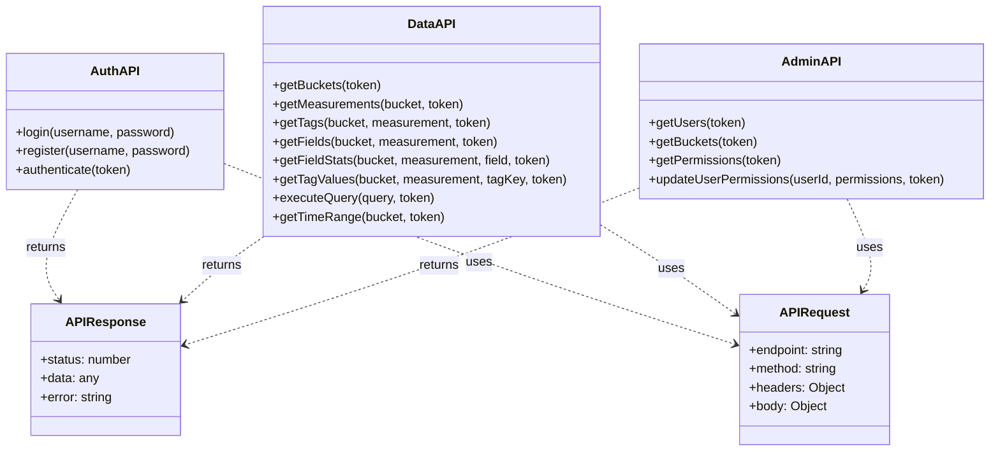

```mermaid
classDiagram
    class AuthAPI {
        +login(username, password)
        +register(username, password)
        +authenticate(token)
    }

    class DataAPI {
        +getBuckets(token)
        +getMeasurements(bucket, token)
        +getTags(bucket, measurement, token)
        +getFields(bucket, measurement, token)
        +getFieldStats(bucket, measurement, field, token)
        +getTagValues(bucket, measurement, tagKey, token)
        +executeQuery(query, token)
        +getTimeRange(bucket, token)
    }

    class AdminAPI {
        +getUsers(token)
        +getBuckets(token)
        +getPermissions(token)
        +updateUserPermissions(userId, permissions, token)
    }

    class APIResponse {
        +status: number
        +data: any
        +error: string
    }

    class APIRequest {
        +endpoint: string
        +method: string
        +headers: Object
        +body: Object
    }

    AuthAPI ..> APIResponse : returns
    DataAPI ..> APIResponse : returns
    AdminAPI ..> APIResponse : returns
    AuthAPI ..> APIRequest : uses
    DataAPI ..> APIRequest : uses
    AdminAPI ..> APIRequest : uses
```
