Certainly! I'd be happy to document this process with both a Mermaid diagram and explanatory text. Let's start with the diagram and then follow up with a detailed textual explanation.

```mermaid
sequenceDiagram
    participant User
    participant Frontend
    participant Backend
    participant UserDB
    participant InfluxDB

    User->>Frontend: Login Request
    Frontend->>Backend: Send Credentials
    Backend->>UserDB: Validate Credentials
    UserDB-->>Backend: Validation Result
    alt is valid
        Backend->>Backend: Generate JWT
        Backend-->>Frontend: Return JWT
        Frontend-->>User: Login Successful
    else is invalid
        Backend-->>Frontend: Auth Error
        Frontend-->>User: Login Failed
    end

    User->>Frontend: Make Data Request
    Frontend->>Backend: Send Request with JWT
    Backend->>Backend: Validate JWT
    alt JWT valid
        Backend->>UserDB: Fetch User's InfluxDB API Key
        UserDB-->>Backend: Return API Key
        Backend->>InfluxDB: Query with API Key
        InfluxDB-->>Backend: Return Data
        Backend-->>Frontend: Send Data
        Frontend-->>User: Display Data
    else JWT invalid
        Backend-->>Frontend: Authorization Error
        Frontend-->>User: Request Failed
    end

```

1. User Authentication:
   - The user initiates the process by sending login credentials to the frontend.
   - The frontend forwards these credentials to the backend.
   - The backend checks the credentials against the UserDB.
   - If valid, the backend generates a JWT and sends it back to the frontend.
   - The frontend stores the JWT (usually in local storage or a secure cookie) for future requests.

2. Data Request Flow:
   - The authenticated user makes a data request through the frontend.
   - The frontend includes the JWT in the request to the backend.
   - The backend validates the JWT.
   - If the JWT is valid, the backend retrieves the user's InfluxDB API key from the UserDB.
   - The backend then uses this API key to query InfluxDB.
   - InfluxDB returns the requested data to the backend.
   - The backend processes the data if necessary and sends it to the frontend.
   - The frontend displays the data to the user.

3. Security Considerations:
   - The InfluxDB API key is never exposed to the frontend or the user.
   - Each user has their own InfluxDB API key, allowing for fine-grained access control.
   - The JWT has an expiration time, requiring periodic re-authentication.
   - If a JWT is invalidated (e.g., on logout), the user loses access without needing to change the InfluxDB API key.

4. Error Handling:
   - Invalid login attempts are rejected at the authentication stage.
   - Requests with invalid or expired JWTs are denied by the backend.
   - Any issues with InfluxDB queries (e.g., permission problems, network issues) are handled by the backend, with appropriate error messages sent to the frontend.
