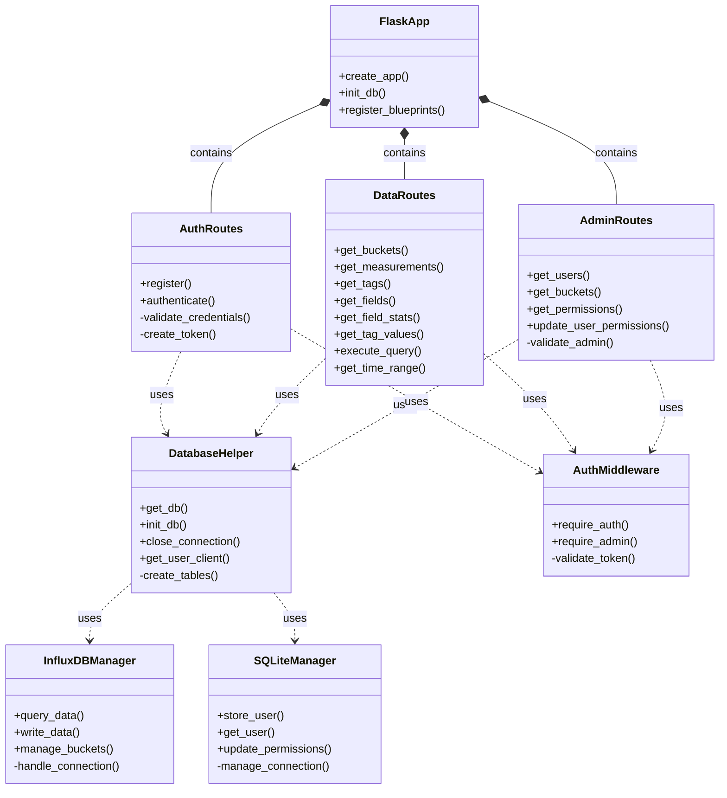

```mermaid
classDiagram
    class FlaskApp {
        +create_app()
        +init_db()
        +register_blueprints()
    }

    class AuthRoutes {
        +register()
        +authenticate()
        -validate_credentials()
        -create_token()
    }

    class DataRoutes {
        +get_buckets()
        +get_measurements()
        +get_tags()
        +get_fields()
        +get_field_stats()
        +get_tag_values()
        +execute_query()
        +get_time_range()
    }

    class AdminRoutes {
        +get_users()
        +get_buckets()
        +get_permissions()
        +update_user_permissions()
        -validate_admin()
    }

    class DatabaseHelper {
        +get_db()
        +init_db()
        +close_connection()
        +get_user_client()
        -create_tables()
    }

    class InfluxDBManager {
        +query_data()
        +write_data()
        +manage_buckets()
        -handle_connection()
    }

    class SQLiteManager {
        +store_user()
        +get_user()
        +update_permissions()
        -manage_connection()
    }

    class AuthMiddleware {
        +require_auth()
        +require_admin()
        -validate_token()
    }

    FlaskApp *-- AuthRoutes : contains
    FlaskApp *-- DataRoutes : contains
    FlaskApp *-- AdminRoutes : contains
    AuthRoutes ..> DatabaseHelper : uses
    DataRoutes ..> DatabaseHelper : uses
    AdminRoutes ..> DatabaseHelper : uses
    DatabaseHelper ..> InfluxDBManager : uses
    DatabaseHelper ..> SQLiteManager : uses
    AuthRoutes ..> AuthMiddleware : uses
    DataRoutes ..> AuthMiddleware : uses
    AdminRoutes ..> AuthMiddleware : uses
```
