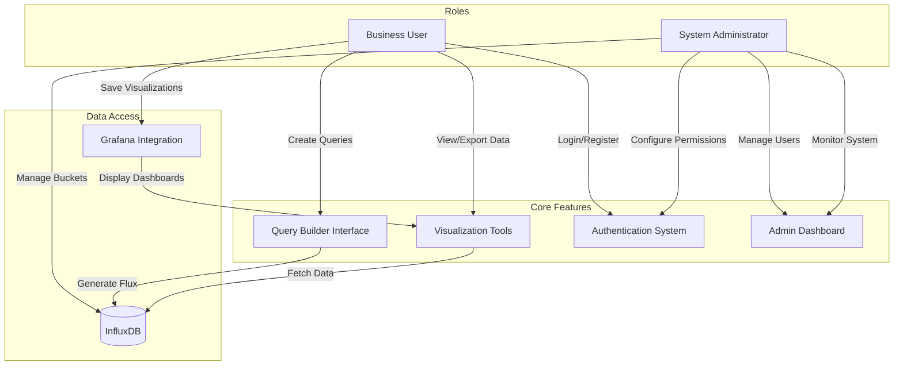

```mermaid
graph TB
    subgraph Roles
        BU[Business User]
        SA[System Administrator]
    end

    subgraph Core Features
        QB[Query Builder Interface]
        VIS[Visualization Tools]
        AUTH[Authentication System]
        AD[Admin Dashboard]
    end

    subgraph Data Access
        DB[(InfluxDB)]
        GR[Grafana Integration]
    end

    %% Business User Interactions
    BU -->|Login/Register| AUTH
    BU -->|Create Queries| QB
    BU -->|View/Export Data| VIS
    BU -->|Save Visualizations| GR

    %% System Administrator Interactions
    SA -->|Manage Users| AD
    SA -->|Configure Permissions| AUTH
    SA -->|Monitor System| AD
    SA -->|Manage Buckets| DB

    %% System Connections
    QB -->|Generate Flux| DB
    VIS -->|Fetch Data| DB
    GR -->|Display Dashboards| VIS
```

