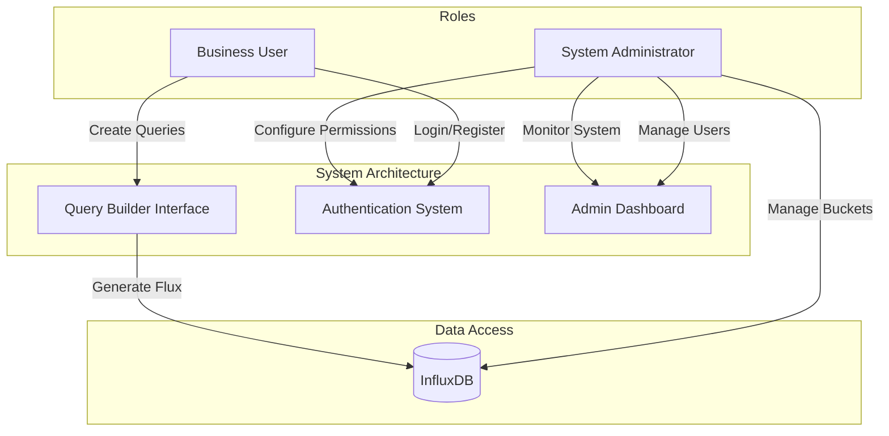

```mermaid
graph TB
    subgraph Roles
        BU[Business User]
        SA[System Administrator]
    end

    subgraph System Architecture
        QB[Query Builder Interface]
        AUTH[Authentication System]
        AD[Admin Dashboard]
    end

    subgraph Data Access
        DB[(InfluxDB)]
    end

    %% Business User Interactions
    BU -->|Login/Register| AUTH
    BU -->|Create Queries| QB

    %% System Administrator Interactions
    SA -->|Manage Users| AD
    SA -->|Configure Permissions| AUTH
    SA -->|Monitor System| AD
    SA -->|Manage Buckets| DB

    %% System Connections
    QB -->|Generate Flux| DB
```

