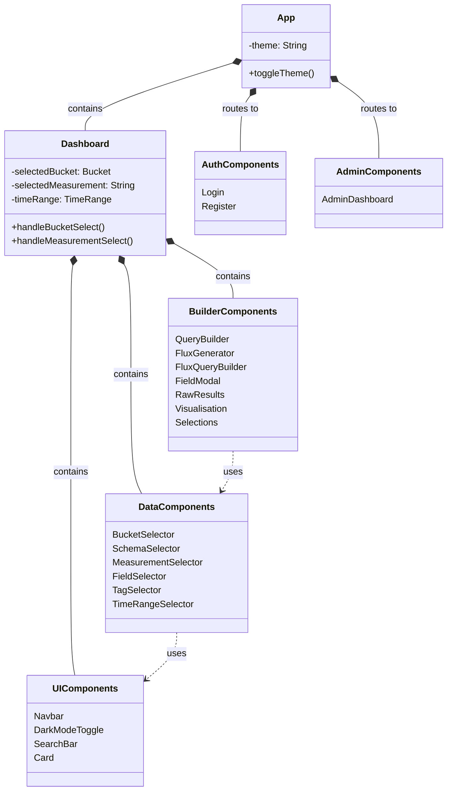

```mermaid
classDiagram
    %% Core
    class App {
        -theme: String
        +toggleTheme()
    }

    %% Main Components
    class Dashboard {
        -selectedBucket: Bucket
        -selectedMeasurement: String
        -timeRange: TimeRange
        +handleBucketSelect()
        +handleMeasurementSelect()
    }

    %% Feature Groups
    class AuthComponents {
        Login
        Register
    }

    class AdminComponents {
        AdminDashboard
    }

    class BuilderComponents {
        QueryBuilder
        FluxGenerator
        FluxQueryBuilder
        FieldModal
        RawResults
        Visualisation
        Selections
    }

    class DataComponents {
        BucketSelector
        SchemaSelector
        MeasurementSelector
        FieldSelector
        TagSelector
        TimeRangeSelector
    }

    class UIComponents {
        Navbar
        DarkModeToggle
        SearchBar
        Card
    }

    %% Relationships
    App *-- Dashboard : contains
    App *-- AuthComponents : routes to
    App *-- AdminComponents : routes to
    Dashboard *-- BuilderComponents : contains
    Dashboard *-- DataComponents : contains
    Dashboard *-- UIComponents : contains
    BuilderComponents ..> DataComponents : uses
    DataComponents ..> UIComponents : uses
```
