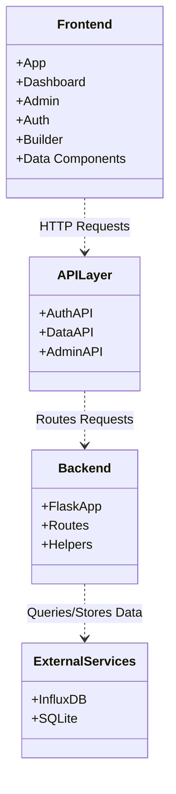

```mermaid
classDiagram
    %% Main Components
    class Frontend {
        +App
        +Dashboard
        +Admin
        +Auth
        +Builder
        +Data Components
    }

    class APILayer {
        +AuthAPI
        +DataAPI
        +AdminAPI
    }

    class Backend {
        +FlaskApp
        +Routes
        +Helpers
    }

    class ExternalServices {
        +InfluxDB
        +SQLite
    }

    %% Relationships
    Frontend ..> APILayer : HTTP Requests
    APILayer ..> Backend : Routes Requests
    Backend ..> ExternalServices : Queries/Stores Data
```

