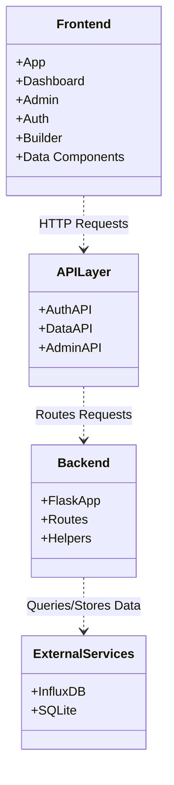
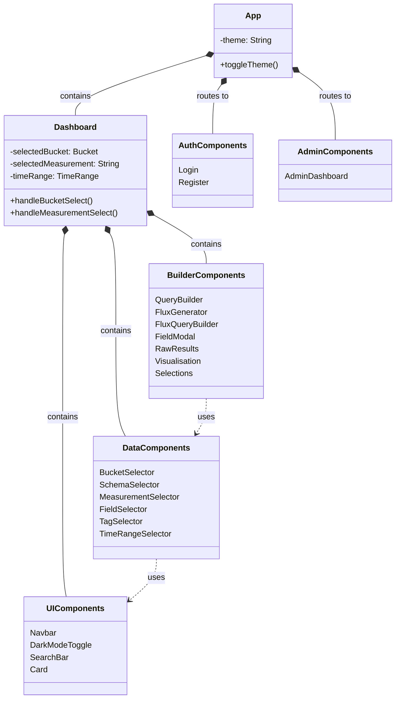
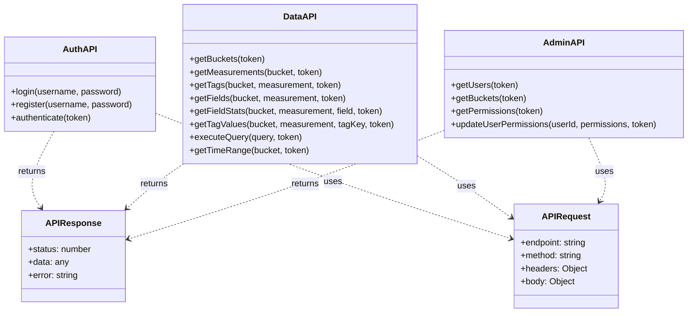
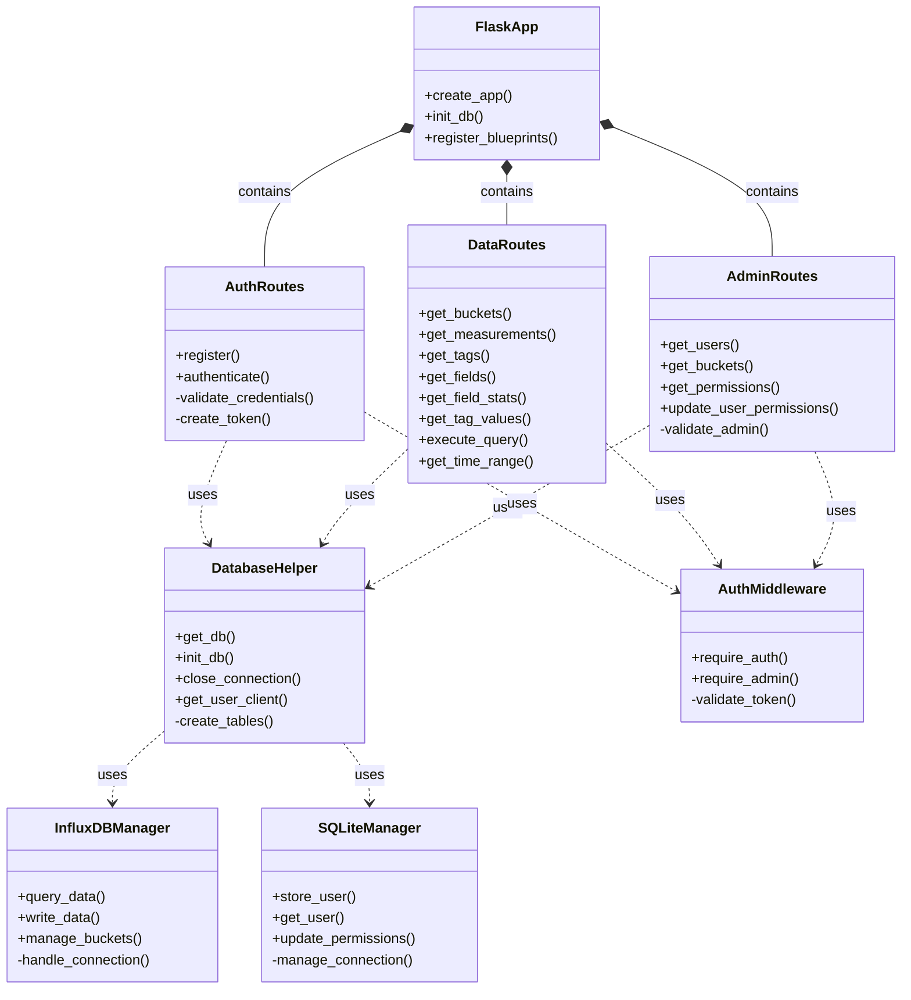

```mermaid
classDiagram
    %% Main Components
    class Frontend {
        +App
        +Dashboard
        +Admin
        +Auth
        +Builder
        +Data Components
    }

    class APILayer {
        +AuthAPI
        +DataAPI
        +AdminAPI
    }

    class Backend {
        +FlaskApp
        +Routes
        +Helpers
    }

    class ExternalServices {
        +InfluxDB
        +SQLite
    }

    %% Relationships
    Frontend ..> APILayer : HTTP Requests
    APILayer ..> Backend : Routes Requests
    Backend ..> ExternalServices : Queries/Stores Data
```

```mermaid
classDiagram
    %% Core
    class App {
        -theme: String
        +toggleTheme()
    }

    %% Main Components
    class Dashboard {
        -selectedBucket: Bucket
        -selectedMeasurement: String
        -timeRange: TimeRange
        +handleBucketSelect()
        +handleMeasurementSelect()
    }

    %% Feature Groups
    class AuthComponents {
        Login
        Register
    }

    class AdminComponents {
        AdminDashboard
    }

    class BuilderComponents {
        QueryBuilder
        FluxGenerator
        FluxQueryBuilder
        FieldModal
        RawResults
        Visualisation
        Selections
    }

    class DataComponents {
        BucketSelector
        SchemaSelector
        MeasurementSelector
        FieldSelector
        TagSelector
        TimeRangeSelector
    }

    class UIComponents {
        Navbar
        DarkModeToggle
        SearchBar
        Card
    }

    %% Relationships
    App *-- Dashboard : contains
    App *-- AuthComponents : routes to
    App *-- AdminComponents : routes to
    Dashboard *-- BuilderComponents : contains
    Dashboard *-- DataComponents : contains
    Dashboard *-- UIComponents : contains
    BuilderComponents ..> DataComponents : uses
    DataComponents ..> UIComponents : uses
```

```mermaid
classDiagram
    class AuthAPI {
        +login(username, password)
        +register(username, password)
        +authenticate(token)
    }

    class DataAPI {
        +getBuckets(token)
        +getMeasurements(bucket, token)
        +getTags(bucket, measurement, token)
        +getFields(bucket, measurement, token)
        +getFieldStats(bucket, measurement, field, token)
        +getTagValues(bucket, measurement, tagKey, token)
        +executeQuery(query, token)
        +getTimeRange(bucket, token)
    }

    class AdminAPI {
        +getUsers(token)
        +getBuckets(token)
        +getPermissions(token)
        +updateUserPermissions(userId, permissions, token)
    }

    class APIResponse {
        +status: number
        +data: any
        +error: string
    }

    class APIRequest {
        +endpoint: string
        +method: string
        +headers: Object
        +body: Object
    }

    AuthAPI ..> APIResponse : returns
    DataAPI ..> APIResponse : returns
    AdminAPI ..> APIResponse : returns
    AuthAPI ..> APIRequest : uses
    DataAPI ..> APIRequest : uses
    AdminAPI ..> APIRequest : uses
```

```mermaid
classDiagram
    class FlaskApp {
        +create_app()
        +init_db()
        +register_blueprints()
    }

    class AuthRoutes {
        +register()
        +authenticate()
        -validate_credentials()
        -create_token()
    }

    class DataRoutes {
        +get_buckets()
        +get_measurements()
        +get_tags()
        +get_fields()
        +get_field_stats()
        +get_tag_values()
        +execute_query()
        +get_time_range()
    }

    class AdminRoutes {
        +get_users()
        +get_buckets()
        +get_permissions()
        +update_user_permissions()
        -validate_admin()
    }

    class DatabaseHelper {
        +get_db()
        +init_db()
        +close_connection()
        +get_user_client()
        -create_tables()
    }

    class InfluxDBManager {
        +query_data()
        +write_data()
        +manage_buckets()
        -handle_connection()
    }

    class SQLiteManager {
        +store_user()
        +get_user()
        +update_permissions()
        -manage_connection()
    }

    class AuthMiddleware {
        +require_auth()
        +require_admin()
        -validate_token()
    }

    FlaskApp *-- AuthRoutes : contains
    FlaskApp *-- DataRoutes : contains
    FlaskApp *-- AdminRoutes : contains
    AuthRoutes ..> DatabaseHelper : uses
    DataRoutes ..> DatabaseHelper : uses
    AdminRoutes ..> DatabaseHelper : uses
    DatabaseHelper ..> InfluxDBManager : uses
    DatabaseHelper ..> SQLiteManager : uses
    AuthRoutes ..> AuthMiddleware : uses
    DataRoutes ..> AuthMiddleware : uses
    AdminRoutes ..> AuthMiddleware : uses
```
