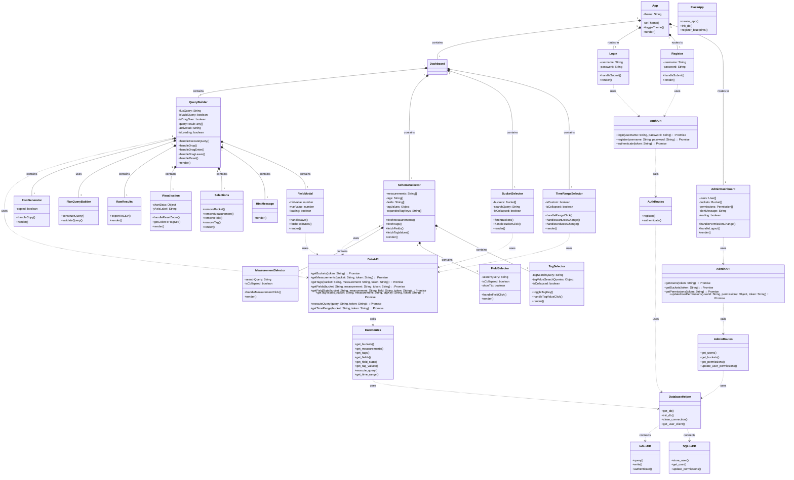

```mermaid
classDiagram
    %% Frontend Components - Complete from previous diagram
    class App {
        -theme: String
        -setTheme()
        +toggleTheme()
        +render()
    }

    class Login {
        -username: String
        -password: String
        +handleSubmit()
        +render()
    }

    class Register {
        -username: String
        -password: String
        +handleSubmit()
        +render()
    }

    class AdminDashboard {
        -users: User[]
        -buckets: Bucket[]
        -permissions: Permission[]
        -alertMessage: String
        -loading: boolean
        +handlePermissionChange()
        +handleLogout()
        +render()
    }

    class QueryBuilder {
        -fluxQuery: String
        -isValidQuery: boolean
        -isDragOver: boolean
        -queryResult: any[]
        -activeTab: String
        -isLoading: boolean
        +handleExecuteQuery()
        +handleDrop()
        +handleDragEnter()
        +handleDragLeave()
        +handleReset()
        +render()
    }

    class FluxGenerator {
        -copied: boolean
        +handleCopy()
        +render()
    }

    class FluxQueryBuilder {
        +constructQuery()
        +validateQuery()
    }

    class FieldModal {
        -minValue: number
        -maxValue: number
        -loading: boolean
        +handleSave()
        +fetchFieldStats()
        +render()
    }

    class RawResults {
        +exportToCSV()
        +render()
    }

    class Visualisation {
        -chartData: Object
        -yAxisLabel: String
        +handleResetZoom()
        +getColorForTagSet()
        +render()
    }

    class HintMessage {
        +render()
    }

    class Selections {
        +removeBucket()
        +removeMeasurement()
        +removeField()
        +removeTag()
        +render()
    }

    class BucketSelector {
        -buckets: Bucket[]
        -searchQuery: String
        -isCollapsed: boolean
        +fetchBuckets()
        +handleBucketClick()
        +render()
    }

    class SchemaSelector {
        -measurements: String[]
        -tags: String[]
        -fields: String[]
        -tagValues: Object
        -expandedTagKeys: String[]
        +fetchMeasurements()
        +fetchTags()
        +fetchFields()
        +fetchTagValues()
        +render()
    }

    class MeasurementSelector {
        -searchQuery: String
        -isCollapsed: boolean
        +handleMeasurementClick()
        +render()
    }

    class FieldSelector {
        -searchQuery: String
        -isCollapsed: boolean
        -showTip: boolean
        +handleFieldClick()
        +render()
    }

    class TagSelector {
        -tagSearchQuery: String
        -tagValueSearchQueries: Object
        -isCollapsed: boolean
        +toggleTagKey()
        +handleTagValueClick()
        +render()
    }

    class TimeRangeSelector {
        -isCustom: boolean
        -isCollapsed: boolean
        +handleRangeClick()
        +handleStartDateChange()
        +handleEndDateChange()
        +render()
    }

    %% API Layer
    class AuthAPI {
        +login(username: String, password: String): Promise
        +register(username: String, password: String): Promise
        +authenticate(token: String): Promise
    }

    class DataAPI {
        +getBuckets(token: String): Promise
        +getMeasurements(bucket: String, token: String): Promise
        +getTags(bucket: String, measurement: String, token: String): Promise
        +getFields(bucket: String, measurement: String, token: String): Promise
        +getFieldStats(bucket: String, measurement: String, field: String, token: String): Promise
        +getTagValues(bucket: String, measurement: String, tagKey: String, token: String): Promise
        +executeQuery(query: String, token: String): Promise
        +getTimeRange(bucket: String, token: String): Promise
    }

    class AdminAPI {
        +getUsers(token: String): Promise
        +getBuckets(token: String): Promise
        +getPermissions(token: String): Promise
        +updateUserPermissions(userId: String, permissions: Object, token: String): Promise
    }

    %% Backend Classes
    class FlaskApp {
        +create_app()
        +init_db()
        +register_blueprints()
    }

    class AuthRoutes {
        +register()
        +authenticate()
    }

    class DataRoutes {
        +get_buckets()
        +get_measurements()
        +get_tags()
        +get_fields()
        +get_field_stats()
        +get_tag_values()
        +execute_query()
        +get_time_range()
    }

    class AdminRoutes {
        +get_users()
        +get_buckets()
        +get_permissions()
        +update_user_permissions()
    }

    class DatabaseHelper {
        +get_db()
        +init_db()
        +close_connection()
        +get_user_client()
    }

    %% External Services
    class InfluxDB {
        +query()
        +write()
        +authenticate()
    }

    class SQLiteDB {
        +store_user()
        +get_user()
        +update_permissions()
    }

    %% Relationships - Frontend to API
    Login ..> AuthAPI : uses
    Register ..> AuthAPI : uses
    AdminDashboard ..> AdminAPI : uses
    BucketSelector ..> DataAPI : uses
    SchemaSelector ..> DataAPI : uses
    QueryBuilder ..> DataAPI : uses
    FieldModal ..> DataAPI : uses
    TimeRangeSelector ..> DataAPI : uses

    %% Relationships - API to Backend
    AuthAPI ..> AuthRoutes : calls
    DataAPI ..> DataRoutes : calls
    AdminAPI ..> AdminRoutes : calls

    %% Relationships - Backend to Database
    AuthRoutes ..> DatabaseHelper : uses
    DataRoutes ..> DatabaseHelper : uses
    AdminRoutes ..> DatabaseHelper : uses
    DatabaseHelper ..> InfluxDB : connects
    DatabaseHelper ..> SQLiteDB : connects

    %% Frontend Component Relationships (from previous diagram)
    App "1" *-- "1" Dashboard : contains
    App "1" *-- "1" Login : routes to
    App "1" *-- "1" Register : routes to
    App "1" *-- "1" AdminDashboard : routes to

    Dashboard "1" *-- "1" QueryBuilder : contains
    Dashboard "1" *-- "1" SchemaSelector : contains
    Dashboard "1" *-- "1" BucketSelector : contains
    Dashboard "1" *-- "1" TimeRangeSelector : contains

    QueryBuilder "1" *-- "1" FluxGenerator : contains
    QueryBuilder "1" *-- "1" FluxQueryBuilder : uses
    QueryBuilder "1" *-- "1" RawResults : contains
    QueryBuilder "1" *-- "1" Visualisation : contains
    QueryBuilder "1" *-- "1" Selections : contains
    QueryBuilder "1" *-- "1" HintMessage : contains
    QueryBuilder "1" *-- "1" FieldModal : contains

    SchemaSelector "1" *-- "1" MeasurementSelector : contains
    SchemaSelector "1" *-- "1" FieldSelector : contains
    SchemaSelector "1" *-- "1" TagSelector : contains
```
