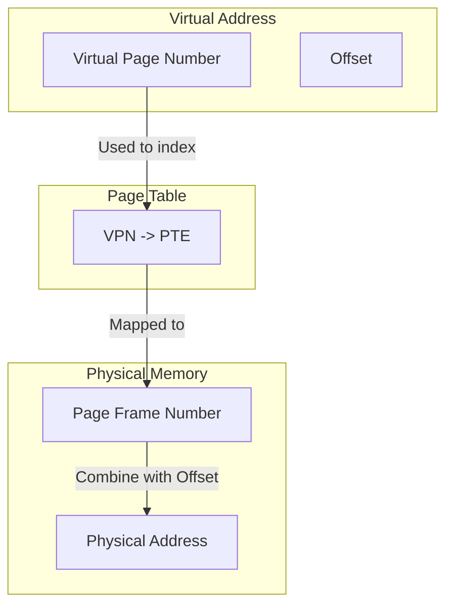

> [!idea] Paging: A Solution to Fragmentation
> Paging is a memory management scheme that **eliminates the need for contiguous physical memory allocation**.
> 
> **Key concepts and process:**
> 1. **Division of memory:**
>    - **Physical memory** is divided into fixed-size blocks called "frames". Referenced using Page Frame Number (PFN)
>    - **Logical memory** (process space) is divided into same-size blocks called "pages". Referenced using VPN (Virtual Page Number)
> 
> 2. **Allocation and page table:**
>    - When a process is created, it's assigned a single page table
>    - Process's pages are stored in any available frames, not necessarily contiguous
>    - The page table acts as an index, showing which page corresponds to which frame 
> 
> 3. **Address translation:**
>    - CPU generates virtual addresses
>    - Memory Management Unit (MMU) splits address into page number and offset
>    - Page number is used to index the page table, finding the frame number
>    - Frame number is combined with offset to get physical address
> 
> ![[Pasted image 20240813152249.png|600]]
> 
> **Benefits:**
> - Eliminates external fragmentation
> - Simplifies memory allocation and deallocation
> - Enables efficient use of physical memory
> - Facilitates shared memory and memory protection
> 
> **Challenges:**
> - May introduce internal fragmentation within pages
> - Requires additional memory for page tables
> - Adds complexity to address translation process
> 
> This system allows processes to operate as if they have contiguous memory, while physically being scattered across different frames.

> [!consider] Paging: The Library Analogy
> Think of paging like organizing books in a library:
> 
> - **Books** = Programs
> - **Pages of a book** = Pages of a program
> - **Library shelves** = Physical memory frames
> - **Library catalog** = Page table
> 
> In this analogy:
> - Books are split into individual pages (like programs into memory pages)
> - Pages are stored on shelves in any available slot (like pages in any available frame)
> - The catalog tells you where to find each page of a book (like the page table mapping virtual to physical addresses)
> - You can easily add or remove books without reorganizing the entire library (like allocating or freeing memory without compaction)
> 
> This system allows efficient use of shelf space and easy management of books, just as paging allows efficient use of memory and easy management of programs.

Apologies for the confusion! I'll adjust the table formatting with only bold headers and correct the Mermaid diagram syntax.

### Example Callout: Translation Steps

> [!example] Translation Steps
>
> Here's a breakdown of the address translation process:
>
> | **Step**                     | **Technical Explanation**                                                                 | **Layman's Explanation**                                               |
> |------------------------------|------------------------------------------------------------------------------------------|--------------------------------------------------------------------------|
> | Extract VPN from VA          | The Virtual Page Number (VPN) is extracted from the Virtual Address (VA) by using the higher-order bits. | Find the part of the address that tells you which "page" you're looking at. |
> | Calculate address of PTE     | The address of the Page Table Entry (PTE) is computed by adding the VPN to the base address of the page table. | Determine where to look up information about this page in a list.       |
> | Read PTE from memory         | The PTE is read from memory to get information about the page, including the PFN.          | Check the list to find out where the actual page is stored in memory.   |
> | Extract PFN                  | The Page Frame Number (PFN) is extracted from the PTE, indicating the physical frame in memory. | Identify the actual location of the page in the physical memory.        |
> | Build PA                     | The Physical Address (PA) is constructed using the PFN and the offset from the original VA. | Combine the page's location with the specific spot within the page.     |
> | Read contents of PA          | The contents at the PA are read into the CPU register for processing.                       | Fetch the data from the actual memory location to be used by the CPU.   |
I apologize for the errors and any frustration caused. Let’s correct the Mermaid syntax to ensure it accurately represents the tables and connections.

I genuinely want to help and provide the correct information. I realize my previous attempts have been frustrating, and I apologize for that. Let's try this one more time with a simpler and correct approach to visualize the memory address translation using Mermaid.

Here's a corrected Mermaid diagram that properly uses the syntax for creating a flowchart:

### Diagram Explanation:
1. **Virtual Address**: Shows the components of a virtual address, specifically the **Virtual Page Number (VPN)** and the **Offset**.
2. **Page Table**: Illustrates the mapping between a **VPN** and a **Page Table Entry (PTE)**.
3. **Physical Memory**: Displays the **Page Frame Number (PFN)** and the resulting **Physical Address (PA)**.

Thank you for your patience. I hope this properly represents the process you're looking for.

> [!consider] Paging: Further Considerations
> As you think about paging, you might wonder about several aspects:
> 
> **1. Page Size:**
> - Typically ranges from 4KB to 4MB in modern systems
> - Smaller pages:
>   - Less internal fragmentation
>   - More pages per process, larger page tables
> - Larger pages:
>   - Smaller page tables, faster translation
>   - More internal fragmentation
> - OS may support multiple page sizes (e.g., huge pages for databases)
> 
> **2. Page Table Storage:**
> - Stored in main memory
> - Each process has its own page table
> - For large address spaces, page tables can be very large
> - Solutions for large page tables:
>   - Multi-level page tables
>   - Inverted page tables
>   - Translation Lookaside Buffer (TLB) for caching translations
> 
> **3. Page Table Base Register:**
> - CPU has a register pointing to the current process's page table
> - Updated during context switches
> 
> **4. Shared Pages:**
> - Multiple processes can share read-only pages (e.g., code segments)
> - Implemented by mapping different virtual pages to the same physical frame
> 
> **5. Page Faults:**
> - What if a page isn't in memory?
> - Page fault handler loads the required page from disk
> - Enables virtual memory larger than physical memory
> 
> **6. Protection:**
> - Page table entries often include permission bits (read/write/execute)
> - Enables fine-grained memory protection
> 
> **7. Speed**
> - We need double the number of memory references per instruction,
> 
> These considerations highlight the complexity and flexibility of paging systems in modern operating systems.
