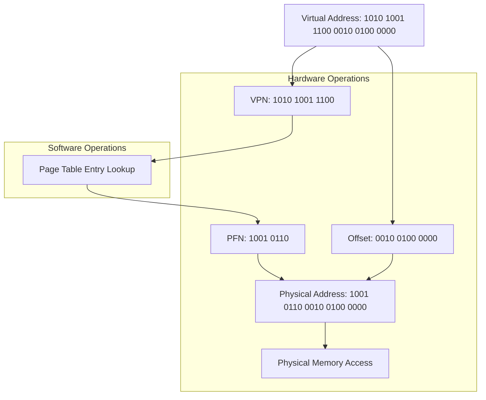

> [!idea] Paging: A Solution to Fragmentation
> Paging is a memory management scheme that **eliminates the need for contiguous physical memory allocation**.
> 
> **Key concepts and process:**
> 1. **Division of memory:**
>    - **Physical memory** is divided into fixed-size blocks called "frames". Referenced using Page Frame Number (PFN)
>    - **Logical memory** (process space) is divided into same-size blocks called "pages". Referenced using VPN (Virtual Page Number)
> 
> 2. **Allocation and page table:**
>    - When a process is created, it's assigned a single page table
>    - Process's pages are stored in any available frames, not necessarily contiguous
>    - The page table acts as an index, showing which page corresponds to which frame 
> 
> 3. **Address translation:**
>    - CPU generates virtual addresses
>    - Memory Management Unit (MMU) splits address into page number and offset
>    - Page number is used to index the page table, finding the frame number
>    - Frame number is combined with offset to get physical address
> 
> ![[Pasted image 20240813152249.png|600]]
> 
> **Benefits:**
> - Eliminates external fragmentation
> - Simplifies memory allocation and deallocation
> - Enables efficient use of physical memory
> - Facilitates shared memory and memory protection
> 
> **Challenges:**
> - May introduce internal fragmentation within pages
> - Requires additional memory for page tables
> - Adds complexity to address translation process
> 
> This system allows processes to operate as if they have contiguous memory, while physically being scattered across different frames.

> [!consider] Paging: The Library Analogy
> Think of paging like organizing books in a library:
> 
> - **Books** = Programs
> - **Pages of a book** = Pages of a program
> - **Library shelves** = Physical memory frames
> - **Library catalog** = Page table
> 
> In this analogy:
> - Books are split into individual pages (like programs into memory pages)
> - Pages are stored on shelves in any available slot (like pages in any available frame)
> - The catalog tells you where to find each page of a book (like the page table mapping virtual to physical addresses)
> - You can easily add or remove books without reorganizing the entire library (like allocating or freeing memory without compaction)
> 
> This system allows efficient use of shelf space and easy management of books, just as paging allows efficient use of memory and easy management of programs.

> [!example] Address Translation Process for Given System
> 
> **System Parameters:**
> - Virtual Memory: 2^32 bytes (32-bit virtual addresses)
> - Physical Memory: 2^22 bytes (22-bit physical addresses)
> - Page Size: 4,096 bytes (2^12 bytes)
> - Virtual Address to translate: 11123456 (decimal) = 0xA9C240 (hex)
> 
> | Step | Operation | Calculation | Explanation | HW/SW |
> |------|-----------|-------------|-------------|-------|
> | 1. Convert VA to binary | - | 0xA9C240 = 1010 1001 1100 0010 0100 0000 | Convert the given decimal VA to binary for processing | SW |
> | 2. Extract Virtual Page Number (VPN) | Right shift by 12 bits | 1010 1001 1100 0010 0100 0000 >> 12 = 1010 1001 1100 | We shift right by 12 because our page size is 4096 bytes (2^12). This removes the 12-bit offset. | HW |
> | 3. Extract Page Offset | Perform bitwise AND with 0xFFF | 1010 1001 1100 0010 0100 0000 & 0000 1111 1111 1111 = 0010 0100 0000 | We perform a bitwise AND operation between the virtual address and 0xFFF (0000 1111 1111 1111 in binary). This keeps only the rightmost 12 bits, which represent the offset within the page. | HW |
> | 4. Look up Page Table Entry (PTE) | Use VPN as index | PTE = Page_Table[1010 1001 1100] | The OS uses the VPN to index into the page table and retrieve the corresponding PTE. | SW |
> | 5. Check if page is in memory | - | Examine present/absent bit in PTE | If the page is not in memory, a page fault occurs and the OS must handle it. | SW |
> | 6. Extract Page Frame Number (PFN) | Perform bitwise AND with PTE | Assume PTE = 1101 0110 1001 0110 0000 0001 PFN = 1101 0110 1001 0110 0000 0001 & 1111 1111 1100 0000 0000 = 0110 1001 0100 0000 0000 | We perform a bitwise AND between the PTE and a mask that isolates the bits representing the PFN. The exact mask depends on the system's PTE format. | HW |
> | 7. Construct Physical Address | (PFN << 12) \| Offset | (0110 1001 0100 0000 0000 << 12) \| 0010 0100 0000 = 0110 1001 0100 0010 0100 0000 | We shift the PFN left by 12 bits to make room for the offset, then perform a bitwise OR with the offset. | HW |
> | 8. Access Physical Memory | - | Read from 0110 1001 0100 0010 0100 0000 | The memory management unit uses this physical address to access the actual data in physical memory. | HW |

> [!consider] Paging: Further Considerations
> As you think about paging, you might wonder about several aspects:
> 
> **1. Page Size:**
> - Typically ranges from 4KB to 4MB in modern systems
> - Smaller pages:
>   - Less internal fragmentation
>   - More pages per process, larger page tables
> - Larger pages:
>   - Smaller page tables, faster translation
>   - More internal fragmentation
> - OS may support multiple page sizes (e.g., huge pages for databases)
> 
> **2. Page Table Storage:**
> - Stored in main memory
> - Each process has its own page table
> - For large address spaces, page tables can be very large
> - Solutions for large page tables:
>   - Multi-level page tables
>   - Inverted page tables
>   - Translation Lookaside Buffer (TLB) for caching translations
> 
> **3. Page Table Base Register:**
> - CPU has a register pointing to the current process's page table
> - Updated during context switches
> 
> **4. Shared Pages:**
> - Multiple processes can share read-only pages (e.g., code segments)
> - Implemented by mapping different virtual pages to the same physical frame
> 
> **5. Page Faults:**
> - What if a page isn't in memory?
> - Page fault handler loads the required page from disk
> - Enables virtual memory larger than physical memory
> 
> **6. Protection:**
> - Page table entries often include permission bits (read/write/execute)
> - Enables fine-grained memory protection
> 
> **7. Speed**
> - We need double the number of memory references per instruction,
> 
> These considerations highlight the complexity and flexibility of paging systems in modern operating systems.
