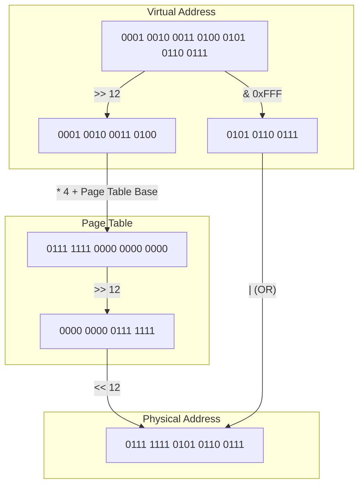

> [!idea] Paging: A Solution to Fragmentation
> Paging is a memory management scheme that **eliminates the need for contiguous physical memory allocation**.
> 
> **Key concepts and process:**
> 1. **Division of memory:**
>    - **Physical memory** is divided into fixed-size blocks called "frames". Referenced using Page Frame Number (PFN)
>    - **Logical memory** (process space) is divided into same-size blocks called "pages". Referenced using VPN (Virtual Page Number)
> 
> 2. **Allocation and page table:**
>    - When a process is created, it's assigned a single page table
>    - Process's pages are stored in any available frames, not necessarily contiguous
>    - The page table acts as an index, showing which page corresponds to which frame 
> 
> 3. **Address translation:**
>    - CPU generates virtual addresses
>    - Memory Management Unit (MMU) splits address into page number and offset
>    - Page number is used to index the page table, finding the frame number
>    - Frame number is combined with offset to get physical address
> 
> ![[Pasted image 20240813152249.png|600]]
> 
> **Benefits:**
> - Eliminates external fragmentation
> - Simplifies memory allocation and deallocation
> - Enables efficient use of physical memory
> - Facilitates shared memory and memory protection
> 
> **Challenges:**
> - May introduce internal fragmentation within pages
> - Requires additional memory for page tables
> - Adds complexity to address translation process
> 
> This system allows processes to operate as if they have contiguous memory, while physically being scattered across different frames.

> [!consider] Paging: The Library Analogy
> Think of paging like organizing books in a library:
> 
> - **Books** = Programs
> - **Pages of a book** = Pages of a program
> - **Library shelves** = Physical memory frames
> - **Library catalog** = Page table
> 
> In this analogy:
> - Books are split into individual pages (like programs into memory pages)
> - Pages are stored on shelves in any available slot (like pages in any available frame)
> - The catalog tells you where to find each page of a book (like the page table mapping virtual to physical addresses)
> - You can easily add or remove books without reorganizing the entire library (like allocating or freeing memory without compaction)
> 
> This system allows efficient use of shelf space and easy management of books, just as paging allows efficient use of memory and easy management of programs.

Certainly. I'll convert the process into a table format with an additional column explaining each step. This should provide a clearer, more structured view of the address translation process.

> [!example] Address Translation Process (Binary)
> 
> | Step | Operation | Binary Representation | Explanation |
> |------|-----------|----------------------|-------------|
> | Initial Virtual Address | - | 0001 0010 0011 0100 0101 0110 0111 | This is our starting 32-bit virtual address. |
> | 1. Extract Virtual Page Number (VPN) | Right shift by 12 bits | 0001 0010 0011 0100 | We shift right by 12 because our page size is 4096 bytes (2^12). This removes the 12-bit offset, leaving us with the 20-bit VPN. |
> | 2. Calculate Page Table Entry (PTE) Address | Multiply VPN by 4, add to Page Table Base | 0001 0000 0100 1000 1101 0000 | We multiply the VPN by 4 (shift left by 2) because each PTE is 4 bytes. Then we add this to the Page Table Base address (0001 0000 0000 0000 0000 0000) to get the PTE's address. |
> | 3. Read Page Table Entry | - | 0111 1111 0000 0000 0000 | We read this value from the memory address calculated in step 2. This is the content of the PTE. |
> | 4. Extract Page Frame Number (PFN) | Right shift by 12 bits | 0000 0000 0111 1111 | We shift right by 12 to remove any flags stored in the lower bits of the PTE, leaving us with the PFN. |
> | 5. Construct Physical Address | (PFN << 12) \| (VA & 0xFFF) | 0111 1111 0101 0110 0111 | We shift the PFN left by 12 bits to make room for the offset, then OR it with the lowest 12 bits (offset) from the original virtual address. |
> | 6. Access Physical Memory | - | - | We use the constructed physical address to read the actual data from physical memory. |

> [!consider] Paging: Further Considerations
> As you think about paging, you might wonder about several aspects:
> 
> **1. Page Size:**
> - Typically ranges from 4KB to 4MB in modern systems
> - Smaller pages:
>   - Less internal fragmentation
>   - More pages per process, larger page tables
> - Larger pages:
>   - Smaller page tables, faster translation
>   - More internal fragmentation
> - OS may support multiple page sizes (e.g., huge pages for databases)
> 
> **2. Page Table Storage:**
> - Stored in main memory
> - Each process has its own page table
> - For large address spaces, page tables can be very large
> - Solutions for large page tables:
>   - Multi-level page tables
>   - Inverted page tables
>   - Translation Lookaside Buffer (TLB) for caching translations
> 
> **3. Page Table Base Register:**
> - CPU has a register pointing to the current process's page table
> - Updated during context switches
> 
> **4. Shared Pages:**
> - Multiple processes can share read-only pages (e.g., code segments)
> - Implemented by mapping different virtual pages to the same physical frame
> 
> **5. Page Faults:**
> - What if a page isn't in memory?
> - Page fault handler loads the required page from disk
> - Enables virtual memory larger than physical memory
> 
> **6. Protection:**
> - Page table entries often include permission bits (read/write/execute)
> - Enables fine-grained memory protection
> 
> **7. Speed**
> - We need double the number of memory references per instruction,
> 
> These considerations highlight the complexity and flexibility of paging systems in modern operating systems.
