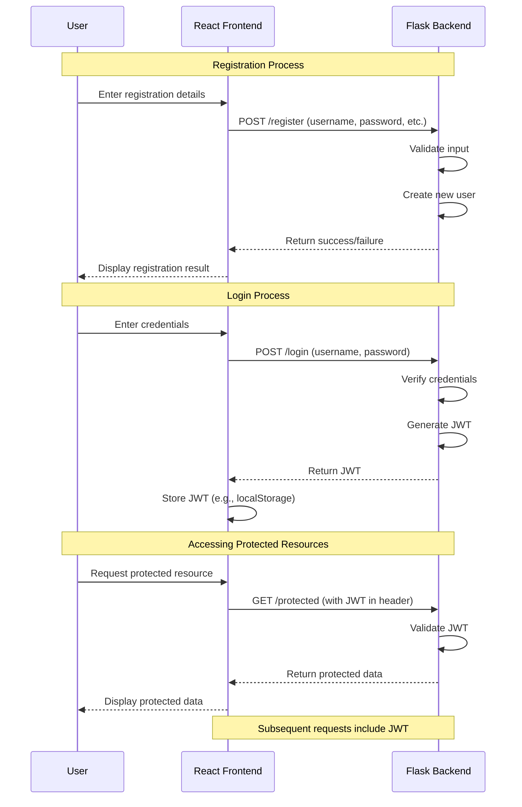

```python
# backend/app/user_db.py
import os

USER_DATA_FILE = os.path.join(os.path.dirname(__file__), 'data', 'users.txt')

def read_users():
    """
    Read user data from a single user inside the users.txt file.
    
    Returns:
        dict: A dictionary of usernames and passwords.
    """
    users = {}
    try:
        with open(USER_DATA_FILE, 'r') as file:
            for line in file:
                username, password = line.strip().split(':')
                users[username] = password
    except FileNotFoundError:
        # Handle the case when the file doesn't exist yet
        pass
    return users

def write_user(username, password):
    """
    Write a new user to the users.txt file.
    
    Args:
        username (str): The username of the new user.
        password (str): The password of the new user.
    
    Returns:
        bool: True if the user was successfully written, False otherwise.
    """
    try:
        with open(USER_DATA_FILE, 'a') as file:
            file.write(f"{username}:{password}\n")
        return True
    except Exception as e:
        print(f"Error writing user: {e}")
        return False

# Ensure the data directory exists
os.makedirs(os.path.dirname(USER_DATA_FILE), exist_ok=True)

# Create the users.txt file if it doesn't exist
if not os.path.exists(USER_DATA_FILE):
    open(USER_DATA_FILE, 'w').close()

# Test code (optional, can be removed in production)
if __name__ == "__main__":
    # Add a test user
    write_user("testuser", "testpassword")
    
    # Read and print all users
    users = read_users()
    print("Users:", users)
```