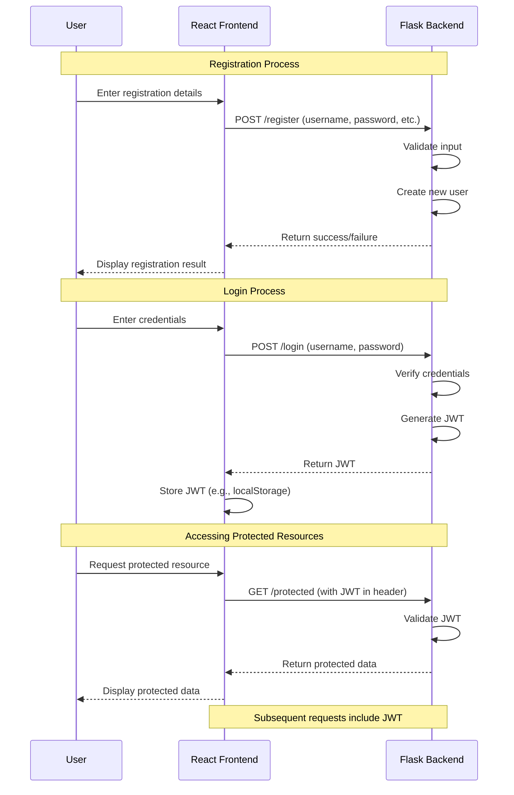

```mermaid
sequenceDiagram
    participant U as User
    participant R as React Frontend
    participant F as Flask Backend
    
    Note over U,F: Registration Process
    U->>R: Enter registration details
    R->>F: POST /register (username, password, etc.)
    F->>F: Validate input
    F->>F: Create new user
    F-->>R: Return success/failure
    R-->>U: Display registration result

    Note over U,F: Login Process
    U->>R: Enter credentials
    R->>F: POST /login (username, password)
    F->>F: Verify credentials
    F->>F: Generate JWT
    F-->>R: Return JWT
    R->>R: Store JWT (e.g., localStorage)
    
    Note over U,F: Accessing Protected Resources
    U->>R: Request protected resource
    R->>F: GET /protected (with JWT in header)
    F->>F: Validate JWT
    F-->>R: Return protected data
    R-->>U: Display protected data
    
    Note over R,F: Subsequent requests include JWT
```

