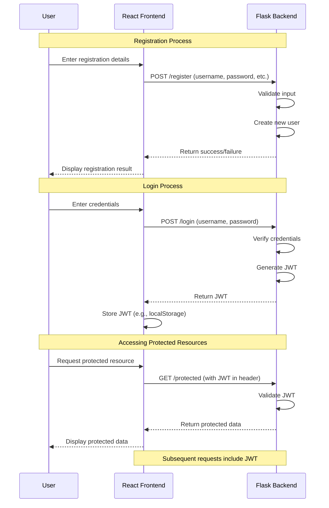

```python
# backend/app/user_db.py
import hashlib
import os

USER_DATA_FILE = 'users.txt'

def hash_password(password):
    return hashlib.sha256(password.encode()).hexdigest()

def register_user(username, password):
    hashed_password = hash_password(password)
    with open(USER_DATA_FILE, 'a') as file:
        file.write(f"{username}:{hashed_password}\n")
    print(f"User {username} registered successfully.")

def authenticate_user(username, password):
    hashed_password = hash_password(password)
    with open(USER_DATA_FILE, 'r') as file:
        for line in file:
            stored_username, stored_password = line.strip().split(':')
            if username == stored_username and hashed_password == stored_password:
                return True
    return False
```